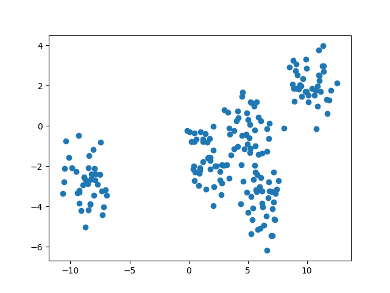

Clustering
==========

**How many clusters do you see in the picture?**

Key Concepts
------------

======================== ===========================================================
concept                  description
======================== ===========================================================
k-Means clustering       algorithm assigning spherical clusters
hierarchical clustering  tree-building (agglomerative) clustering algorithms
DBSCAN                   clustering algorithm that takes outliers into account
Curse of dimensionality  euclidean distance does not work well for higher dimensions
Silhouette Score         metric assessing the spherical shape of clusters
ARI                      metric comparing a clustering to a "gold standard"
======================== ===========================================================

What is clustering used for?
----------------------------

-  Inventory categorization
-  Behavioral segmentation (e.g. by purchase history, activities on application, website, or platform)
-  Define personas based on interests
-  Create profiles based on activity monitoring
-  Detect activity types in motion sensors
-  Group images
-  Separate audio
-  Identify groups in health monitoring
-  Detecting bots
-  Anomaly or outlier detection

Clustering in scikit-learn
--------------------------

Compare the K-Means and DBScan algorithms on the moons dataset using the script below.

1. Run the script
2. Exchange `moons` for `blobs`
3. Adjust the parameters `n_clusters` and `eps` to improve the clustering

.. literalinclude:: clustering.py

Recap Questions
---------------

-  What are the strengths and weaknesses of K-Means, hierarchical clustering and DBScan?
-  How can you evaluate a clustering?
-  What is the curse of dimensionality?

.. seealso::

   -  `Clustering methods comparison in scikit-learn <http://scikit-learn.org/stable/auto_examples/cluster/plot_cluster_comparison.html>`__
   -  `Top 5 Clustering Algorithms <https://towardsdatascience.com/the-5-clustering-algorithms-data-scientists-need-to-know-a36d136ef68>`__
