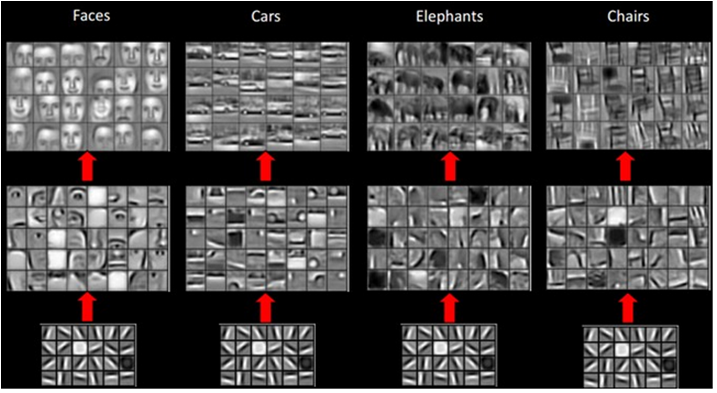

.. _cnn:

Convolutional Neural Networks
=============================

.. container:: banner warmup

   Face recognition

.. highlights::

   .. image:: cnn_face.png

   The image shows a single convolutional filter that detects eyes.

   How would the weights look like in a filter that detects a mouth?

Convolutional Layers
--------------------

**Convolutional Neural Networks (CNN) represent spatial relationships**

Convolutional Layers apply a **sliding window** that processes only a portion of the input at a time.
They therefore represent **spatial relationships** between pixels.

A Convolutional Layer contains not just one set of weights for processing a portion of the input.
They contain many sets of weights that are called **filters** or **kernels**. 
During training, each feature map specializes in a particular feature of the input.

The output of a single Convolutional filter is called a **feature map**.

In an early Convolutional Layer these features might be dots, straight lines and angles. 
Subsequent Convolutional Layers combine the features of the previous Layers so that they recognize more complex geometrical shapes, and ultimately entire objects.

`By Aphex34 - Own work, CC BY-SA 4.0 <https://commons.wikimedia.org/wiki/File:Conv_layer.png>`__

MaxPooling
----------

Very often, Convolutional Layers are followed by a MaxPooling layer.
Max Pooling condenses the information in a CNN by selecting only the largest value in a sliding 2D window.

.. image:: max_pooling.png

`By Aphex34 - Own work, CC BY-SA 4.0 <https://commons.wikimedia.org/w/index.php?curid=45673581>`__

Pooling shrinks the size of the data. 
It also averages out shifts by a few pixels.

Note that a MaxPooling layer does not have any trainable parameters.

CNN Layers in TensorFlow
------------------------

A basic setup of a CNN with 10 filters and MaxPool layer could look like this:

.. code:: python3

   from tensorflow.keras.layers import Conv2D, MaxPooling2D, Flatten

   model = Sequential([

       Conv2D(
              10, 
              kernel_size=(3, 3),
              strides=(2, 2),
              padding="same", 
              activation="relu",
              input_shape=(28, 28, 1)
              ),

       MaxPooling2D(
              pool_size=(3, 3),
              strides=(2, 2),
              padding="same"
              ),

       Flatten(),

       Dense(1, activation="sigmoid"),  # for binary classification

       ])

You could add more CNN layers before the flattening without the `input_shape` parameter.
The input data would have to have the shape `(N, 28, 28, 1)`, where N is the number of data points.

Hyperparameters of Convolutional Layers
---------------------------------------

Some hyperparameters of a convolutional layer are:

-  the kernel size (typically 3x3 or 5x5)
-  the **stride** or step width in which the sliding window moves
-  the number of filters (roughly equivalent to the number of neurons in a Dense layer
-  whether **padding** is applied (adding zeroes around the borders of the input image).

Convolutional Layers with two dimensions are the most common, but 1D and 3D layers also exist (useful for processing audio/video).

.. container:: banner reading

   Links

.. highlights::

   -  `Interactive visualization of a CNN <http://scs.ryerson.ca/~aharley/vis/conv/flat.html>`__
   -  `Interpretable CNNs <https://distill.pub/2018/building-blocks/>`__

   .. youtube:: FTr3n7uBIuE

----

.. container:: banner recap

   Recap Questions

.. highlights::

   -  What advantages does a CNN have over fully connected layers for image classification?
   -  Why do you use max pooling layers?
   -  What do you need to change to use a CNN on a color input image?
   -  What does the `Flatten()` layer do?
