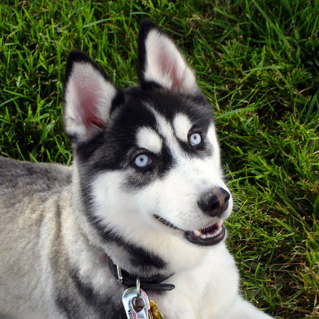
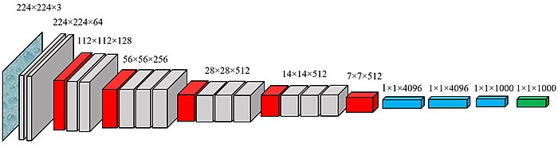
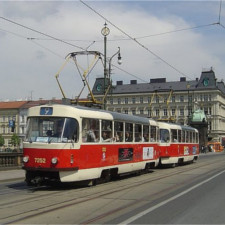

Pretrained Networks
===================

*is it a Canadian or Siberian Husky? (image: Wikimedia Commons)*

The ImageNet Competition
------------------------

Throughout the 2010's, the `ImageNet Competition <http://image-net.org/challenges/LSVRC/2017/>`__ has been the most important benchmark for computer vision.

Rules of the **Object Localization** task:

1. Input is a single image, output is a single class
2. There are 300,000+ labeled training images
3. Image size is **224 x 224 x 3**
4. There are `1000 object categories <http://image-net.org/challenges/LSVRC/2014/browse-synsets>`__

.. container:: banner warmup

   ImageNet Models

.. highlights::

   Take a look at the ImageNet competition results on `paperswithcode.com <https://www.paperswithcode.com/sota/image-classification-on-imagenet>`__ .

   Find **VGG-19**, **Inception V3** and **ECA-Net (MobileNetV2)**

   -  which model performed best?
   -  which model has the most / least parameters?
   -  what problems would you expect when predicting 1000 categories in photographs?

The VGG-16 Architecture
-----------------------

This is the structure of VGG-16, a well-known pretrained CNN for image classification:

image from `everybodywiki <https://en.everybodywiki.com/VGG_Net>`__ (CC BY-SA 3.0)

**gray:** CNN layers, **red:** pooling layers, **blue:** dense layers, **green:** softmax

----

VGG-16 is good model to understand the structure of an industry-scale CNN.
It consists of:

- the first Convolutional Layer has a large image and few filters
- the second Convolutional Layer is followed by a Max Pooling Layer
- after that, another block of two Convolutional Layers and one MaxPool follows. The image becomes smaller but has more filters
- after five such blocks, the output is fed into a fully connected (dense) layer
- the last layer is a dense layer with a softmax activation function, producing the probabilities of 1000 categories

The VGG-16 is not the state of the art anymore. It is very big (you need at least 12 GB RAM to run it and much more to train it).
Later developments used many algorithmic tricks to squeeze out a few percent of accuracy and to cut down the size of the network by an order of magnitude.

MobileNet
---------

**MobileNet** is a pretrained network that gives predictions with a similar accuracy as VGG-16.
But MobileNet is small enough to run on a phone!

This example runs a prediction on the sample image of a tram.

Step 1: Read an image
+++++++++++++++++++++

First, read the image and use the preprocessing function to reshape the array:

.. code:: python3

   from tensorflow.keras.preprocessing import image
   from tensorflow.keras.applications.mobilenet_v2 import MobileNetV2, preprocess_input, decode_predictions

   im = image.load_img('tram.jpg', target_size=(224, 224))

You can view the image in Jupyter by typing `im`.

.. code:: python3

   a = image.img_to_array(im)
   a = preprocess_input(a)

Inspect the shape and dtype of the resulting array.

Step 2: Load MobileNetV2
++++++++++++++++++++++++

Import and initialize the model.

.. code:: python3

   m = MobileNetV2(weights='imagenet', include_top=True)
   m.summary()

What familiar elements do you see in the summary of the model?

Step 3: Prediction
++++++++++++++++++

Finally, predict the probabilities of 1000 classes and print the 10 most probable ones:

.. code:: python3

   from pprint import pprint

   a = a.reshape(1, 224, 224, 3)
   p = m.predict(a)
   pprint(decode_predictions(p, 10))

Inspect the numbers in `p` as well.

Step 4: Larger Images
+++++++++++++++++++++

You can process larger images as well by shrinking them with the `Pillow` library:

.. code:: python3

   im = image.load_img('...')  # <-- add your file name
   im.size
   
and use Pillow to cut out a square you are interested in:

.. code:: python3

   im2 = im.crop((0, 0, 1000, 1000))  # xstart, ystart, xend, yend
   im3 = im2.resize((224, 224))
   im3

The preprocessing and prediction on `im3` is the same as above.

.. container:: banner reading

   Further Reading

.. highlights::

   -  `ImageNet website <http://image-net.org/challenges/LSVRC/2017/>`__
   -  `the original VGG paper <https://arxiv.org/abs/1409.1556>`__
   -  `CNN catches up with dermatologists recognizing melanoma <https://academic.oup.com/annonc/advance-article/doi/10.1093/annonc/mdy166/5004443>`__
