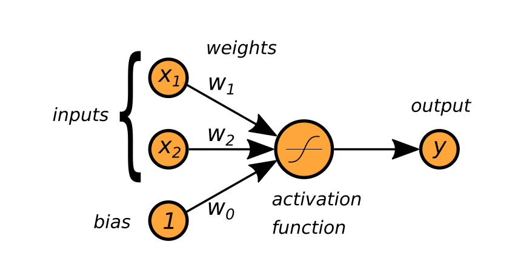
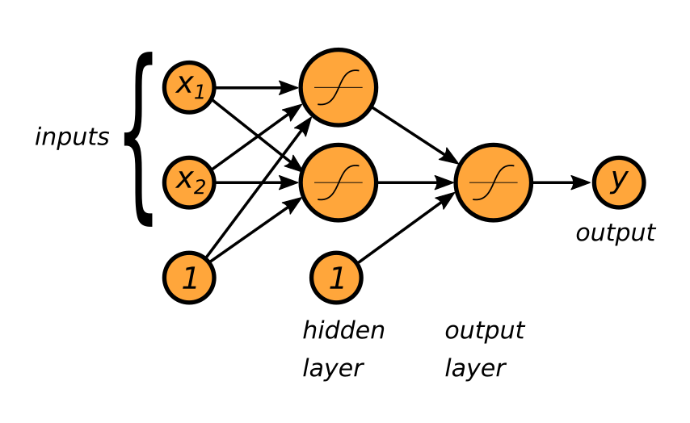

.. _neuralnet:

Artificial Neural Networks
==========================

.. container:: banner warmup

   The Origin of Neural Networks

.. highlights::

   .. figure:: neuron_med.jpeg
      :alt:

   **How does a biological neuron work? Brainstorm what you know.**

   Neural networks are inspired from the way biological neurons work.
   Despite this common origin, Artificial Neural Networks work very differently.
   As an analogy, think how birds fly and how planes fly.

What is Deep Learning?
----------------------

The terms **Artificial Neural Network** (ANN) and **Deep Learning**
usually refer to the same thing.

The first neural networks were experimented with in the 1950s. During
their history they have resurfaced several times, only to become uninteresting again.
Over the last decade, ANNs have started a
triumphant rise to the most powerful type of machine learning we know today.

.. seealso::

   `historical timeline of Artificial Neural Networks <https://www.datasciencecentral.com/profiles/blogs/most-cited-deep-learning-papers>`__

.. topic:: What is Deep Learning used for?

   Neural Networks are used for nonlinear problems tasks with complex input data:

   -  recognizing objects in images
   -  face recognition
   -  speech recognition in a home assistant
   -  automatic translation

.. warning::

   Training neural networks requires large datasets. Training from scratch with fewer than 10,000 data points is a bad idea most of the time.

How Artificial Neurons work
---------------------------

In a single neuron, inputs and bias are multiplied with weights and then transformed by an activation function:

.. container:: banner math-logo

   Math Equations

.. highlights::

   The maths behind a neuron can be described by a single formula:

   .. math::

      \hat y = f(X \cdot w + w_0)

   **Does that equation look familiar to you?**

   The function *f* is called **activation function**. What do you get if you use a linear or sigmoid activation function?

.. container:: banner challenge2

   Set the weights manually

.. highlights::

   Set the coefficients :math:`w_1`, :math:`w_2` and the bias :math:`w_0` of the neuron in such a way that it implements a logical AND:

   ::

      | x1 | x2 | desired output |
      |----|----|----------------|
      |  0 |  0 |              0 |
      |  1 |  0 |              0 |
      |  0 |  1 |              0 |
      |  1 |  1 |              1 |

   Could you also implement a logical OR?

.. _feedforward:

Feed-Forward Networks
---------------------

In **Feed-Forward Neural Networks** (also called Multi-Layer Perceptrons or MLPs), there are multiple neurons and two or more **layers**. 
The first layers are called **hidden layers**. The last one is called **output layer**. The information moves strictly from left to right:

Hypothetically, a network with two layers is large enough to learn anything.
In practice, *deep* networks with multiple layers and other architectures are much more efficient.

.. container:: banner math-logo

   Math Equations

.. highlights::

   Neurons on top of neurons extend the equation above by a the hidden layer:

   .. math::

      \hat y = f^{out}(f^{hidden}(X \cdot w^{hidden} + w^{hidden}_0) \cdot w^{out} + w^{out}_0)

.. container:: banner challenge1

   XOR in Python

.. highlights::

   The logical XOR is more challenging:

   ::

      | x1 | x2 | desired output |
      |----|----|----------------|
      |  0 |  0 |              0 |
      |  1 |  0 |              1 |
      |  0 |  1 |              1 |
      |  1 |  1 |              0 |

   XOR is a **non-linear problem** that puzzled researchers for years half a century ago.
   You need a hidden layer to solve it.
   Feel free to try finding the weights on your own.

   The code below implements the feed-forward network from the diagram:

   .. literalinclude:: feed_forward.py

   .. note::

      There is a solution where all three biases are zero.

.. container:: banner reading

   Further Reading

.. highlights::

   This video explains the basics of neural networks:

   .. youtube:: aircAruvnKk

   The Asimov Institute has published an `Overview of the most common Neural Network architectures <http://www.asimovinstitute.org/neural-network-zoo/>`__
