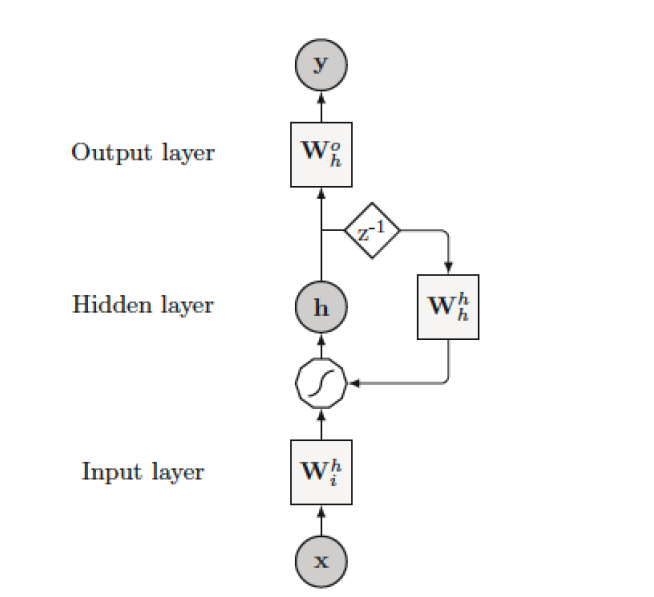
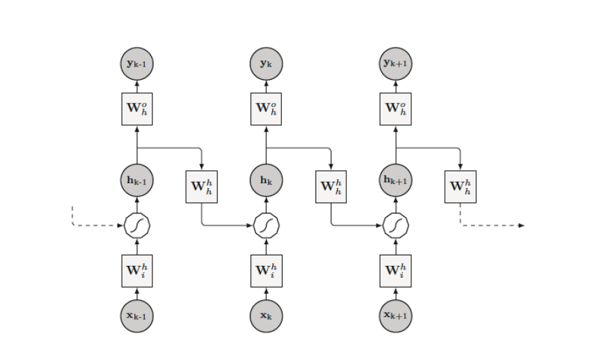

Recurrent Neural Networks
=========================

.. figure:: recurrent.jpeg
   :alt:

from `https://github.com/Vict0rSch/deep_learning/tree/master/keras/recurrent <https://github.com/Vict0rSch/deep_learning/tree/master/keras/recurrent>`__

Architecture of RNNs
--------------------

RNNs recursively compute new states by using information from previous states and inputs.
Put simply, the output for the next time step is:

.. math::

   y_{t+1} = f(y_t, X_{t+1})

   Simple RNN architecture

The architecture of a general RNN can be seen as a weighted, directed, and cyclic
graph that contains three different kinds of nodes, namely the input,
hidden, and output nodes.

The circles represent input :math:`\mathbf{x}`, hidden,
:math:`\mathbf{h}`, and output nodes, :math:`\mathbf{y}`, respectively.
The solid squares :math:`W^h_i`, :math:`W_h^h`, and :math:`W_h^o` are
matrices representing input, hidden, and output weights.
The polygon represents the nonlinear transformation (activation function) performed by neurons and :math:`z^{-1}` is the unit delay operator

Backpropagation Through Time
----------------------------

The key difference of an unfolded RNN with respect to a standard Feed-Forward-NN
is that the weight matrices are constrained to assume the same values in
all replicas of the layers, since they represent the recursive
application of the same operation.

Through this transformation the network can be trained with standard
learning algorithms, originally conceived for feedforward architectures.
This learning procedure is called **Backpropagation Through Time (BPTT)**
(Rumelhart et al. 1985) and is one of the most successful techniques
adopted for training RNNs.

   RNN unfolded into a feed-forward network

LSTM Cells
----------

Regular RNN cells suffer from a significant disadvantage: they are bad at representing long-term correlations in the data. The influence of early time steps becomes more and more diluted as the RNN propagates in time. Moreover, the gradient is hard to calculate over long distances, making it difficult to train very deep RNNs at all.

.. image:: lstm.png

**LSTM (Long Short-Term-Memory) cells** come to the rescue. They encode a long-term memory using 5 separate activations. These activations are responsible for:

* forwarding the input to the output
* storing the input in the long-term memory
* modifying the output by the long-term memory
* erasing the long-term memory

`More details <https://colah.github.io/posts/2015-08-Understanding-LSTMs/>`__

Applications of RNNs
--------------------

+------------+------------+----------------------------------------------------+
| input      | output     | applications                                       |
+============+============+====================================================+
| vector     | vector     | use a normal ANN instead!                          |
+------------+------------+----------------------------------------------------+
| sequence   | vector     | sentiment analysis                                 |
+------------+------------+----------------------------------------------------+
|            |            | categorize text                                    |
+------------+------------+----------------------------------------------------+
|            |            | recommender based on history (collab. filtering)   |
+------------+------------+----------------------------------------------------+
| vector     | sequence   | create image caption                               |
+------------+------------+----------------------------------------------------+
| sequence   | sequence   | forecasting stock prices                           |
+------------+------------+----------------------------------------------------+
|            |            | weather forecast                                   |
+------------+------------+----------------------------------------------------+
|            |            | per-character sentiment                            |
+------------+------------+----------------------------------------------------+
|            |            | video captioning                                   |
+------------+------------+----------------------------------------------------+
| sequence   | sequence   | machine translation (encoder-decoder)              |
+------------+------------+----------------------------------------------------+

----

Example: Song Generator
-----------------------

- :download:`Aretha Franklin Generator <song_generator.py>`

.. container:: banner reading

   Further reading

.. highlights::

   - `LSTM-written Harry Potter chapter <https://www.botnik.org/content/harry-potter.html>`__

----

.. container:: banner recap

   Recap Questions

.. highlights::

   -  What are the advantages of a LSTM over a fully connected neural network?
   -  What tradeoff do you need to consider when deciding a sequence length for training a LSTM?
   -  What is an encoder-decoder RNN?
