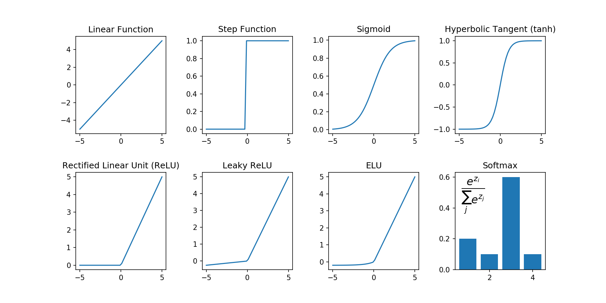

Training Strategies
===================

Neural Networks are very complex non-linear models.
They are trained by the **backpropagation** algorithm (a sophisticated application of Gradient Descent).
Backpropagation is not easy to work with. It is very prone to overfitting and getting stuck in local minima.

Generic Training Strategy
-------------------------

1. Start with a tiny network
++++++++++++++++++++++++++++

Build a network with very few layers and neurons first. Check whether your input and output shapes are correct.
All you are interested in at this point is that your code runs without errors.

2. Simple training
++++++++++++++++++

Increase the size of the network moderately. Run the network and observe the loss function / accuracy.
Now you are looking for proof that the network is actually learning *something*.

3. Go bigger
++++++++++++

Increase the size of the network further. Make it as big as you can afford to wait.
The point of this is to probe how far you can push the learning. Observe the learning curves closely.

4. Optimize and Regularize
++++++++++++++++++++++++++

Probably your network is overfitting by now. Gradually make it smaller again.
If necessary, add regularization.
Keep an eye on the learning curves and make sure you don't lose any validation accuracy.

5. Production
+++++++++++++

Save the model, version it and observe how it performs in production.

Activation Functions
--------------------

========== ====== =============================
function   layer  description
========== ====== =============================
Linear     output regression
Sigmoid    output binary classification
Softmax    output multiclass classification
ReLU       hidden good first coice
Leaky ReLU hidden avoids "dying ReLU" problem
ELU        hidden better but more expensive
tanH       hidden usually slower than ReLU
step       -      not fully differentiable
========== ====== =============================

There is no single best choice. A rule of thumb is:

::

   ELU  > Leaky ReLU > ReLU > tanh > sigmoid

Loss Functions
--------------

**Loss functions** (cost functions) are the objective functions we are
trying to minimize in training.

================================      =======================================
function                              description
================================      =======================================
log-loss / binary-cross-entropy       binary classification
categorical-cross-entropy             multiclass classification
MSE                                   for regression tasks
hinge loss                            penalizes wrong classifications
triplet loss                          used in some image classification tasks
================================      =======================================

Regularizing Deep Neural Networks
---------------------------------

Early Stopping
++++++++++++++

Early Stopping is a complementary strategy that helps you to stop the training at the right moment.
It monitors the *validation loss*. When it starts increasing over ``patience`` epochs, the training is stopped.

The **patience** parameter is necessary, because the loss may sometimes fluctuate (especially when using Dropout).

With Keras:

.. code:: python3

    from tensorflow.keras.callbacks import EarlyStopping

    callback = EarlyStopping(monitor='val_loss', patience=3)
    model.fit(..., callbacks=[callback], validation_split=0.2)

Batch Normalization
+++++++++++++++++++

Batch Normaliztion adds two hyperparamters per layer that normalize the
inputs to the activation function to a given average and scale.

Batch Normalization has shown a couple of promising effects:

-  strongly reduces training time
-  improves the accuracy of the outcome
-  acts as a regularization technique

As a slight drawback, the predictions take place slightly slower because
of the additional operation.

In Keras, add BatchNorm after the activation:

.. code:: python3

   from tf.keras.layers import BatchNormalization
   ...
   Dense(10),
   Activation('relu'),
	 BatchNormalization(),
	 ...

.. seealso::

   `Batch Normalization in Neural Networks <https://towardsdatascience.com/batch-normalization-in-neural-networks-1ac91516821c>`__

The Vanishing Gradient Problem
++++++++++++++++++++++++++++++

It is possible to train an ANN using a sigmoid activation function
and Gradient Descent. For bigger networks, this approach will
likely run into the **Vanishing Gradient Problem**.
In the Vanishing Gradient Problem, the gradients during backpropagation become very small in the early layers. The training will then take very long.
The sigmoid function is very prone to the vanishing gradient problem.
The root cause of this problem is that the variance of the inputs and outputs is different.

Dropout
+++++++

Dropout is probably the most important regularization technique for ANNs.

In Dropout, random neurons are excluded from the training process.
The remaining neurons have to perform regardless.
This builds robustness into the network, because it avoids over-specialization of single neurons.
When using the trained network for prediction, **all** neurons participate.

Add Dropout layers before the activation:

.. code:: python3

   from tensorflow.keras.layers import Dropout

   ...
   Dense(10),
   Dropout(0.5),
   Activation('relu'),
   ...

.. hint::

   **How many neurons to drop?**

   As a rule of thumb:

   -  in an input layer, drop 20% of the neurons
   -  in a hidden layer, drop 50% of the neurons
   -  in the output layer, do not use Dropout

.. note::

   Other regularization strategies include:

   -  L1 and L2 norms
   -  Gradient Clipping
   -  Data Augmentation (with image data)

Improve and regularize an MNIST model
-------------------------------------

**Goal: achieve at least 95% accuracy on the validation set.**

Step 1
++++++

-  Build a Dense ANN with five hidden layers of 25 neurons each
-  Add a softmax output layer with ten neurons

Step 2
++++++

-  Train the model with ``optimizer='adam'``
-  Use a batch size of at least 500
-  Run 100 epochs.
-  What accuracy do you reach?
-  Is the network overfitting?

Step 3
++++++

-  Add Early Stopping. After how many epochs does it stop?

Step 4
++++++

-  Add Batch Normalization to every layer.
-  Compare the learning curves: is it converging faster than before?
-  Is it still overfitting?

Step 5
++++++

-  Add dropout to every hidden layer and try again. Does it help?

.. seealso::

   -  `Batch Normalization <https://towardsdatascience.com/batch-normalization-in-neural-networks-1ac91516821c>`__
   -  `Which order should your layers be in? <https://forums.fast.ai/t/order-of-layers-in-model/1261/3>`__

Reflection questions
--------------------

-  How many neurons do you need in the output layer if you want to classify email into spam/not spam?
-  What activation function would you need in the output layer of a spam classifier?
-  How many neurons would you need in the output layer if you want to predict the price of houses from their features?
-  Is it okay to initialize all the weights to the same value as long as that value is selected randomly?
