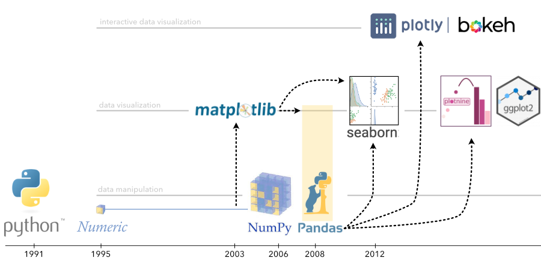

Python Libraries for Machine Learning
=====================================

History of Python plotting libraries:

Machine Learning
----------------

The table below gives you a rough overview:

============= ============================================================================================================
Library       description
============= ============================================================================================================
scikit-learn  general-purpose Machine Learning library
statsmodels   package for training sophisticated linear models and forecasting time series
catboost      efficient implementation of Gradient Boosting that handles many categorical features
scipy         scientific computing, contains hundreds of numerical functions (e.g. numerical optimization and FFT)
surprise      recommender package compatible to scikit-learn
TensorFlow    Deep Learning package developed by Google. Capable of distributed computing
PyTorch       Deep Learning package developed by Facebook. Comparable to TensorFlow
spacy         package for tokenizing and analyzing text
RPy2          adapter package for using R from Python
============= ============================================================================================================

Helper Libraries
----------------

============= ============================================================================================================
Library       description
============= ============================================================================================================
NumPy         low-level vectors and matrix data structures, used for linear algebra and handling data in Python
pandas        comfortable data analysis package, built on top of NumPy
imblearn      helper package for learning with imbalanced datasets
Pillow        helper package for basic image manipulation
scikit-image  package with more sophisticated image processing methods
Flask         lightweight web server frequently used to make models available as web services
FastAPI       even more lightweight package to build JSON APIs, built on top of Flask
MLFlow        helps recording and versioning models
============= ============================================================================================================

Big Data
--------

============================================ ======================================================================================
Library                                      description
============================================ ======================================================================================
`Apache Arrow <https://arrow.apache.org/>`__ an execution layer for in-memory data
`Numba <http://numba.pydata.org/>`__         Just-In-Time compilation, faster than NumPy
`Paperspace <https://www.paperspace.com/>`__ notebooks, alternative to AWS / Google
SQL                                          for big data, check AWS Redshift, Google BigQuery, Hive, smartlake
Dask                                         out-of-memory version of pandas that works for big data sets as well
Spark                                        distributed computing platform that does many things that pandas and scikit would do
PyTables                                     flexible tabular data structure for huge datasets
============================================ ======================================================================================

More about scaling up pandas:

   .. youtube:: ggS2oK-ewFk