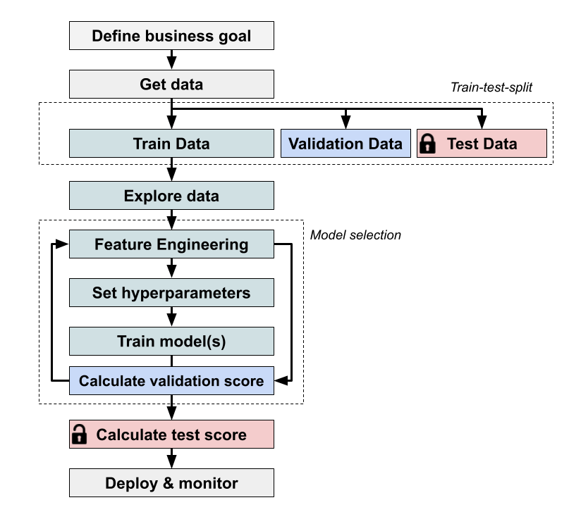

Training Models
===============

Steps in a Machine Learning Project
-----------------------------------

Train-Validation-Test-Split
---------------------------

After you collect your data, you should split the dataset into **training data**, **validation data** and **test data**. 
You will not touch the **test data** 
until the end of the workflow. Why do we do that?

In the end we are mostly interested in how good our model is if applied to unseen data (data it has not been trained on).
To estimate how good it is on unseen data we will use part of our dataset, the **test data**, to simulate this scenario. We **train** 
our model on the **training data** and select the a few best models based on an evaluating them on the **validation data**. 
Only and at the very end, after we made all possible decisions about the model, 
we evaluate how good it works for unseen **test data**.

Scikit-learn provides a function to randomly split our data into training and validation (or test) data:

.. code:: python3

   from sklearn.model_selection import train_test_split

   Xtrain, Xtest, ytrain, ytest = train_test_split(X, y, test_size=0.25, random_state=42)

In a continuous ML project that is running in production, you may need to put some data aside to regularly check your model quality.

Scikit-learn
------------

Scikit-Learn is one of the most important Machine Learning packages in Python.

======================= =======================================================
concept                 description
======================= =======================================================
Estimators              how models in Scikit-learn are called
``m.fit()``             method to train (**only call on training data**)
``m.predict()``         creates a prediction for unknown data
``m.transform()``       transforms features (in some models)
``train_test_split()``  splits data in a training and test portion
``random_state``        parameter for reproducible random numbers
======================= =======================================================

Overfitting
-----------

When your model is too powerful, it learns the data by heart instead of recognizing generic patterns.
This is called overfitting.
**When your training score is much better than the validation/test score, the model is overfitting.**

Overfitting is more likely with:

* few data points
* many input features
* models with many parameters

Underfitting
------------

Underfitting means the model is performing worse than it could.
**When your training and validation/test scores are both bad, the model is underfitting.**

Underfitting is more likely when:

* you have not understood/explored the data yet
* you lack Feature Engineering
* the model oversimplifies (too few parameters)

Baseline Models
---------------

A baseline is a simple model that is supposed to give you a lower boundary.
It helps debugging a lot.

Comparing your model against a baseline also helps to check whether your model is too complicated.
This is especially true for complicated machine learning solutions that require a lot of resources. When
presenting a new approach we need to justify its high costs!

Baseline models can be:

- heuristic rules that are simple can understand (such as: *"always predict 1 for a returning customer"*)
- 'predict' the class that is most frequent in the training sample (the majority class)
- a random guess of the class outcome
- previous state-of-the-art models

`sklearn` offers some naive baseline classifiers with the `DummyClassifier` class:

.. code:: python3

  from sklearn.dummy import DummyClassifier

  dummy = DummyClassifier(strategy='most frequent')
  dummy.fit(Xtrain, ytrain)
  dummy.predict(Xtest)

.. container:: banner recap

   Recap Questions

.. highlights::

   -  What is a test set and why would you want to use it?
   -  What is a validation set and why would you want to use it?
   -  Why is setting a random seed useful when dividing datasets into training and test portions?
   -  How can you recognize overfitting?
