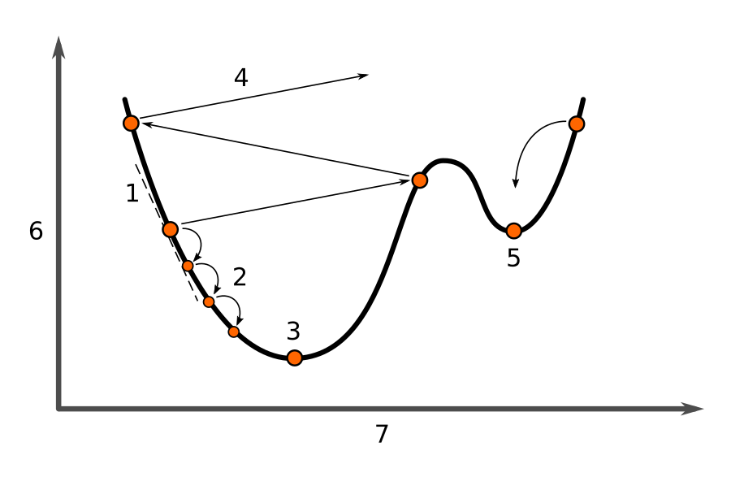
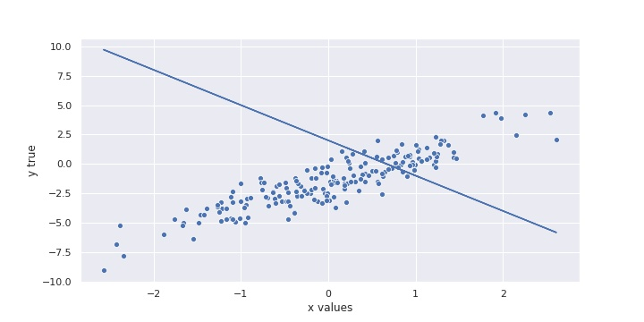

Gradient Descent
================

**Gradient Descent is the most important algorithm in Machine Learning.**

Warmup Puzzle
-------------

Identify the seven concepts in the diagram using the syllables:

::

   AL BAL CE CON DI DI ENT ER FUNC GING GING GLO GRA LOC
   LOSS MET MI MI MUM MUM NI NI ON PARA SPA TI VER VER

Key Concepts
------------

============================ ======================================================
concept                      description
============================ ======================================================
Gradient Descent             iterative algorithm to find optimal parameters
Gradient                     partial differential over all features
Loss function                the function that is optimized
Learning rate                factor that determines the size of steps
Stochastic Gradient Descent  variant using randomly selected points
Mini-Batch Gradient Descent  variant using random samples of points
============================ ======================================================

Background
----------

Gradient Descent is an algorithm used to fit the parameters of a model.
More technically, Gradient Descent finds the minimum of a **loss function** in a **parameter space**.

**Loss function** means the metric used to measure the quality of a model.
It is not the estimate :math:`\hat y` of the dependent variable.

**Parameter space** means that we consider all possible combinations of parameters.
Because a model might have many parameters, this space is multi-dimensional.
Of course, it is too complex to try out all possible combinations.

Instead, we move through the parameter space in iterative steps, minimizing the loss function.
The key equation for calculating the weight modification :math:`\triangle a` is:

.. math::

   \triangle a = -\eta \triangledown loss(a)

This equation calculates the **gradient** of the loss function.
The variable :math:`\eta` is called the **learning rate**.
The learning rate is multiplied with the **gradient of the loss function**.

What is a gradient?
-------------------

The gradient is the slope of a function in each considered dimension.
In our case, it is the **first derivative** of the loss function.

Unfortunately, we cannot use a simple derivative function,
because we have to differentiate by multiple parameters.
This is called a **partial differential** or **Jacobian**.

Therefore, the resulting gradient of the loss function :math:`loss(a)` is a vector containing
all its partial derivatives at the point *a*

What is a loss function?
------------------------

The minimized function is called the **loss function**. It depends on the optimization problem, typically:

-  **MSE** in linear regression
-  **log-loss** in binary classification
-  **crossentropy** in multinomial classification
-  **hinge loss** in SVMs.

Many applications use their own, custom loss functions.

.. question:: Why is scaling features important?

   Gradient Descent will take longer if features are not on a similar scale.

   **Andrew Ng's rule of thumb** says that if the features
   range from -3 to +3 it is OK.

Pseudocode
----------

The Gradient Descent Algorithm starts with a **random guess**
and performs minimization steps
until it reaches optimal values for the parameters.

Here is the pseudocode:

::
   
   1. set all model parameters to random values
   2. calculate the partial derivative of the loss function (the MSE) for each parameter
   3. multiply each derivatives with the learning rate :math:`\eta`
   4. modify the model parameters by the resulting vector
   5. repeat steps 2-4 until the loss function does not change

Stochastic Gradient Descent
---------------------------

When you have lots of data, the standard GD algorithm using all data points
at every step becomes slow. There are two similar solutions:

-  **Stochastic Gradient Descent (SGD)** uses one randomly chosen data point at a time.
-  **Batch Gradient Descent** uses randomly chosen subsets. This is the default when training neural networks.

.. seealso::

   - `Overview of Gradient Descent algorithms <http://ruder.io/optimizing-gradient-descent/index.html>`__
   - `Video: Gradient Descent Step by Step <https://www.youtube.com/watch?v=sDv4f4s2SB8>`__

Exercise: Gradient Descent from Scratch
---------------------------------------

Step 1: Load the data
+++++++++++++++++++++

Add the missing imports to load the file :download:`part1/linear07.csv`
and add a dummy column:

.. code:: python3

   df = pd.read_csv("linear07.csv")
   df["bias"] = 1

Inspect the data to make sure you have the right number of rows/columns.

Then extract the dependent and independent columns

.. code:: python3

   X = df[[...]]
   ytrue = df[...]
   

Step 2: The Model
+++++++++++++++++

In a nutshell, our gradient descent algorithm will optimize the parameters of a linear function
in such a way that the error between the output of that function
(:math:`\hat y`) and the actual values (`y`) becomes **minimal**.

We assume a **linear function** to approximate our data set:

.. math::

   \hat y = a_1 x_1 + a_2 x_2 + a_3 x_3 + ... + a_0

Here, :math:`a_0` is the intercept, and the other :math:`a_i` are the slopes.

.. question::

   How many parameters should your model have?

To start, write a Python function called ``linear_model()`` that
accepts two arguments: the data and the parameters
and returns a list of "predicted" y values based on those parameters.

.. code:: python3

   # insert: X, a, dot, return
   def linear_model(X, a):
       ___ np.___(___, ___)

To check if your function works, try inputting random values into your function
and plot the results -- even if it's an intentionally bad "guess"!

.. code:: python3

    plt.plot(df["x1"], linear_model(X, -3.0, 2.0))

Step 3: The Loss Function
+++++++++++++++++++++++++

Our code is working, but of course the parameters we gave were bad!
But that's okay -- we have to start from somewhere!
And it shouldn't matter too much how bad our initial prediction was,
because it's going to be the algorithm's job to find the best parameters.

We (as humans) can visually tell from the plot that our initial parameters
gave us a bad prediction / line of best fit.

But how can a computer tell that it's "bad"?

We need a way of quantifying the error (or *loss*) between the predicted and
actual values. In Machine Learning, this is referred to as a **loss function**.
Here we will use the **Mean Squared Error** as a loss function:

.. math::

    \frac{1}{n}\sum_{i=1}^{n}(y_i-\hat y_i)^2

Write a python function called ``mse`` that encodes the equation above --
accepting X, ytrue and the parameters a as arguments -- and returns a single value
for the mean-squared-error.

.. code:: python3

   # insert into the code: mse, mean, ytrue, yhat
   def ___(ytrue, yhat):
       return np.___((___ - ___) ** 2)

If you wrote your function correctly, then the following assert statement should
not return an error.

.. code:: python3

    a = np.array([1.0, 1.2, 1.4, 1.6])
    b = np.array([0.2, 0.4, 0.6, 0.8])

    assert round(mse(a, b), 2) == 0.64

Step 4: The Gradient
++++++++++++++++++++

The essence of gradient descent is -- *after determining the error between the
predicted values and the actual values* -- deciding by how much to tweak each
of the parameters in such a way that the new values for the parameters result in
a smaller loss than before! So for our vector of model parameters (a=[a0, a1]),
we need to calculate...

.. math::

    a_{new} = a_{old} + \triangle a

so that for the new a the MSE should be smaller than before.

How do we calculate an appropriate change for each parameter (Δa) that achieves
this objective?
Well, as seen in a few of the images in the material above, the delta part of the
equation evaluates to:

.. math::

    \triangle a = -\eta \triangledown loss(a)

The toughest part about implementing the algorithm is understanding what
the ∇ loss(a) part means. This term represents the **gradient of the loss
function for each model parameter inside a**. Another way of saying this is
**calculating the first-order partial derivatives of the loss function with
respect to each of the model parameters.**
And since we are dealing with more than one parameters
in this example, we need to calculate a partial derivative.

Write a python function called ``calc_gradient`` that takes 3 arguments:
the X data, ytrue and the parameters a.
It should calculate the numeric partial derivative for
each parameter based on a small incremental change *da*,
and then return the 2 partial derivatives.

The resulting list of partial derivates is called the **gradient**.

Some of the code is already filled in to help you get started:

.. code:: python3

    def calc_gradient(X, ytrue, a):

      epsilon = 0.0001  # a tiny increment
      ypred = ...
      mse_old = ...

      # derivative for first parameter
      a1_change = a.copy()
      a1_change[0] += epsilon
      ypred_a1 = ...
      mse_a1 = ...
      deriv_a1 = (mse_a1 - mse_old) / epsilon

      # derivative for second parameter
      ...

      return [...]  # all partial derivatives

.. hint::

    Think of how to incorporate the ``linear_model`` function that you created before.

.. hint::

    You don't need to work out the analytical solution to the derivate of the
    loss function. You can approximate it numerically using the
    `definition of the derivative <http://tutorial.math.lamar.edu/Classes/CalcI/DefnOfDerivative.aspx>`_!

Step 5: Repeat
++++++++++++++

Implement the gradient descent algorithm! For this, you'll need to run a loop.

Start by initializing a few variables. For example:

.. code:: python3

  LEARNING_RATE = 0.1  # start with a small learning rate
  MAX_ITER = 100 

  a = np.random.random(size=...)  # random starting values

Transcribe the following pseudo-code into python:

::

   Repeat the following steps `MAX_ITER` times. 
   In each iteration of the loop:
   
   1. Calculate the gradient of the loss function 
      with respect to each model parameter.
   2. If the gradient becomes close to zero, exit
   3. Update each model parameter using the gradient
   4. Print the MSE and all variables to check if they
      are converging.

Step 6: Experiment
++++++++++++++++++

Make the learning rate very small and/or very large. What happens?

Step 7: Plot
++++++++++++

Plot the loss function over time.

Recap Questions
---------------

-  Which function are Gradient Descent algorithms minimizing?
-  What is a local optimum?
-  How much is the gradient at the minimum?
-  Do all runs of the Gradient Descent algorithms lead to the same solution?
-  If the *training* loss goes up consistently, what is happening? How can you fix this?
-  When is Stochastic Gradient Descent a better option?
-  When would a Gradient Descent algorithm fail to find the optimal solution?

**by Paul Wlodkowski**
