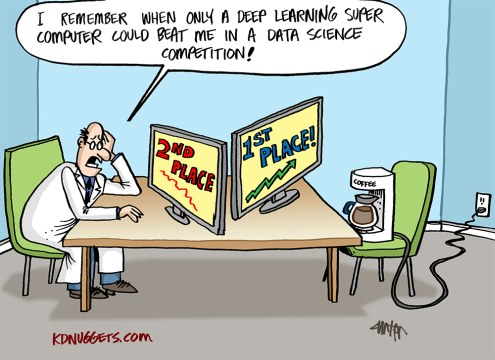
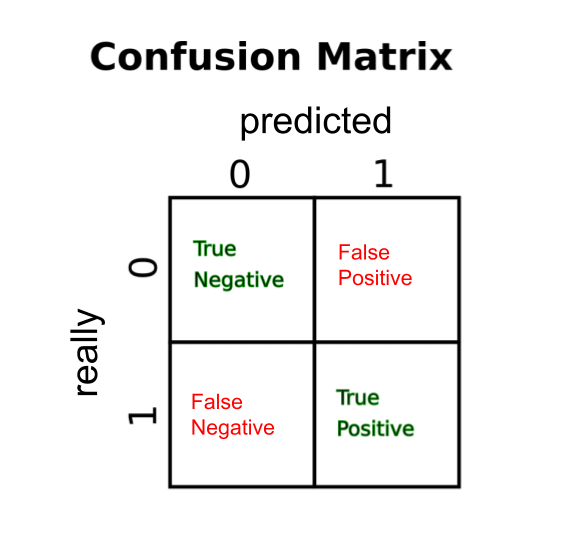

.. _eval_classifiers:

Evaluating Classifiers
======================

*source:* `kdnuggets <https://www.kdnuggets.com/2015/12/cartoon-data-science-contest-coffeemaker.html>`__

.. container:: banner warmup

    Cancer Detection

.. highlights::

    This is a simplified example inspired by `this paper <https://bmcmedimaging.biomedcentral.com/articles/10.1186/s12880-019-0307-7>`__:

    Two new skin cancer detection classifiers have been developed and tested on 1000 images of patients' skins of which 50 show signs of cancer:
        - The first model predicts a high risk of cancer for 800 out of 1000 patients' images in the test set. Of these 800 images 50 actually show signs of skin cancer. Hence, all problematic images are correctly identified.
        - The second classifier categorizes 100 out of 1000 images into the high risk group. 40 of the 100 images show real signs of cancer. 10 images are not identified and falsely classified as low-risk.

    Compare the outcome of these two classifiers. Which one do you prefer?

Key Concepts
------------

======================= ================================
concept                 description
======================= ================================
Confusion Matrix        Shows the performance of a classifier in a single table
Accuracy                The percentage of correct guesses
Precision               Percentage of positive classified observations that are positive
Recall                  Percentage of positive observations correctly classified as positve
F1-Score                (Harmonic) average of precision and recall
ROC-Curve               Line-plot of the true positive against the false positive rate for different treshold values
AUC                     Area under the curve: Measures the relative area under the ROC-curve
======================= ================================

Confusion Matrix
----------------

For (binary) classification problems, each observation from the training or test set can be assigned to one of four groups:

- `True negatives` and `True positives` are correctly classified observations
- `False positives` are classified as positive (encoded as `True`/`1`) but are negative in reality.
- `False negatives` are classified as negative (encoded as `False`/`0`/`-1`) but are positive in reality.

We can easily summarize the performance of a (binary) classifier by counting the number of observations in each category.
This frequency table is called a **confusion matrix**:

Entries that are off the diagonal are incorrect classifications. The `sklearn.metrics` module from the scikit-learn package contains many statistics for evaluation:

.. code:: python3

  from sklearn.metrics import confusion_matrix

  confusion_matrix(ytrue, ypred)

Version ``1.x`` of sklearn also has a convenient function to plot confusion matrices:

.. code:: python3

   from sklearn.metrics import ConfusionMatrixDisplay

   ConfusionMatrixDisplay.from_predictions(ytrue, ypred, normalize=None)

By default, the matrix contains absolute counts.

The parameter ``normalize`` converts the values to percentages.
It be set to ``true`` or ``pred`` so that the rows and columns add up to 1.0,
or to ``all`` in which case the sum of the entire matrix will be 1.0.

Accuracy
--------

By looking at the confusion matrix we can calculate various statistics that summarize the performance of a classifier in a single number.
The accuracy is by far the most popular. It measures the relative frequency of correct predictions:

.. math::

   acc = \frac{TN + TP}{TN + TP + FN + FP}

The accuracy score is straightforward to calculate with scikit.

.. code:: python3

  from sklearn.metrics import accuracy_score

  ypred = m.predict(X)
  acc = accuracy_score(ytrue, ypred)

Precision
---------

The precision score measures the number of observations correctly classified as `True`
as a fraction of all observations classified as `True`:

.. math::

   prec = \frac{TP}{TP + FP}

The signature of the corresponding function in scikit is the same as for accuracy.

.. code:: python3

   from sklearn.metrics import precision_score

Recall/ True Positive Rate
--------------------------

Recall measures the number of observations correctly classified as `True` as a
fraction of all observations with the class `True`:

.. math::

   rec = \frac{TP}{TP + FN}

.. code:: python3

  from sklearn.metrics import recall_score

F1-Score
--------

The F1-Score is a weighted (`harmonic <https://en.wikipedia.org/wiki/Harmonic_mean#Harmonic_mean_of_two_numbers>`__) average between precision and recall:

.. math::

   F_1 = 2 \cdot \frac{precision \cdot recall}{precision + recall}

In practice, the F1 will drop as soon as precision or recall drop.

.. code:: python3

     from sklearn.metrics import f1_score

.. container:: banner debug

   Look it up

.. highlights::

   **Aren't these equations very similar and easy to mix up?**

   Yes they are! After teaching them for 4+ years, I still look them up on Wikipedia every time, just to be on the safe side.

.. container:: banner reading

   Further Reading

.. highlights::

   - `Scikit classification_report <https://scikit-learn.org/stable/modules/generated/sklearn.metrics.classification_report.html>`__
   - `Visualizing ROC curves and confusion matrices with Scikit <https://scikit-learn.org/stable/visualizations.html#visualizations>`__
   - `Classification metrics available in Scikit <https://scikit-learn.org/stable/modules/model_evaluation.html#classification-metrics>`__
   - `Beyond Accuracy, Precision and Recall <https://towardsdatascience.com/beyond-accuracy-precision-and-recall-3da06bea9f6c>`__

.. container:: banner recap

   Reflection Questions

.. highlights::

   -  When is accuracy **not** a good metric?
   -  For which real-world examples is high recall more important than high precision? When is precision more important than recall?
