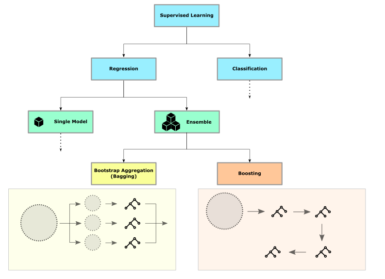

.. _random_forest:

Random Forests
==============

**Random Forests are models combining many Decsion Trees. They use the bagging strategy.**

Bagging vs Boosting
-------------------

The Algorithm
-------------

1. Draw a random sample from the training data (of equal size)
2. Train a Decision Tree model
3. At each node of the tree, randomly choose a subset of the features to be available
4. Repeat steps 1-3 several times and collect all the trees
5. To make a prediction, collect the prediction from each tree and output the most frequent one (classification) or take their average (regression)

Key Concepts
------------
======================= ==============================================
concept                 description
======================= ==============================================
ensemble                a model consisting of many sub-models
bagging                 several models trained in parallel
boosting                several models trained on top of each other
Random Forest           an ensemble of randomized decision trees
Voting                  the mechanism to combine the output of trees
======================= ==============================================

Random Forests in Scikit-learn
------------------------------

.. code:: python3

   from sklearn.ensemble import RandomForestClassifier

   m = RandomForestClassifier(n_estimators=100, max_depth=4, random_state=42)
   m.fit(Xtrain, ytrain)

To fine-tune the model you can experiment with the hyperparameters ``max_depth`` and ``n_estimators``. 
There are several more hyperparameters available not shown here in detail.

Pros and Cons of Random Forests
-------------------------------

============================================ =============================================
Pros                                         Cons
============================================ =============================================
handle a mix of categorical and scalar data  prone to overfitting
automatically select important features      regression trees cannot extrapolate
produce high-quality models                  
can be used for regression, too              
great as a *"first shot"*                    
fast
============================================ =============================================

.. container:: banner reading

   Further Reading

.. highlights::

   -  `Random Forest infographic <https://github.com/Avik-Jain/100-Days-Of-ML-Code/blob/master/Info-graphs/Day%2033.jpg>`__
   -  `Random Forest visualization <http://www.r2d3.us/visual-intro-to-machine-learning-part-1/>`__
   
   .. youtube:: E7VLE-U07x0

.. topic:: Business Case: Real-Time Human Pose Recognition

   In the paper `Real-Time Human Pose Recognition in Parts from a Single Depth Image <https://www.microsoft.com/en-us/research/publication/real-time-human-pose-recognition-in-parts-from-a-single-depth-image/?from=https%3A%2F%2Fresearch.microsoft.com%2Fpubs%2F145347%2FBodyPartRecognition.pdf>`__
   the authors trained a random forest model to accurately predict 3D positions of
   body joints from a single depth image, using no temporal information.

   .. figure:: microsoft_kinect.png

   *(the image has been cropped from the research paper)*

      

.. container:: banner recap

   Reflection Questions

.. highlights::

   -  Where does the randomness of a RandomForest model come from?
   -  Does the performance of a Decision Tree improve if you scale the data?
   -  How does the number of trees in a Random Forest affect the training and test score?
   -  Can you speed up training of a Random Forest by distributing it to multiple processors or machines?

