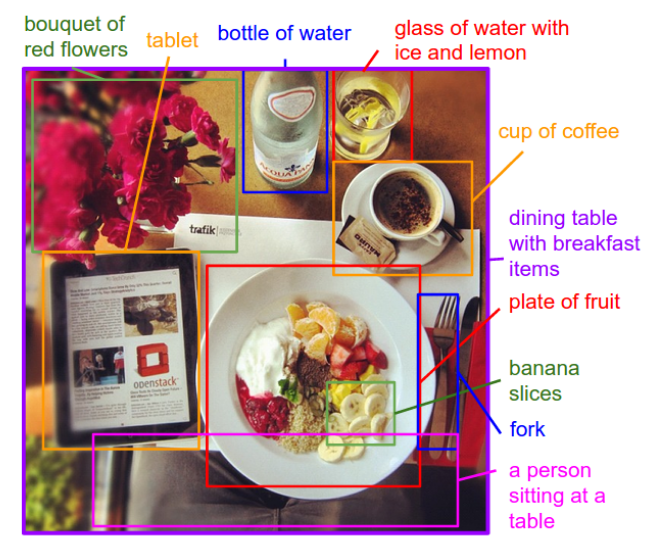

.. _transfer_learning:

Transfer Learning
=================

**Transfer Learning means reusing an already trained network for a similar purpose.**

.. seealso::

   `Image Captioning Paper (2015) <https://www.cv-foundation.org/openaccess/content_cvpr_2015/papers/Karpathy_Deep_Visual-Semantic_Alignments_2015_CVPR_paper.pdf>`__

Why do we need transfer learning?
---------------------------------

**Convolutional Neural Networks are costly to train.** They need huge amounts of training data (10M labeled images for industry-scale image processing) and CPU power.
The promise of transfer learning is to use an already trained network for a slightly similar task.
Thereby:

- the training is faster
- you need less training data
- you can change the nature of the task (e.g. do regression instead of classification)

There are three main strategies for transfer learning.

Use intermediate output
-----------------------

The intermediate output of a CNN after the flattening is a matrix (tensor). 
It can be used as input for a conventional Machine Learning model (e.g. a LogReg or SVM). 

The following code uses a pretrained network without the output layer.

.. code:: python3

   from tensorflow.keras.applications import MobileNet

   base_model = MobileNet(
                          include_top=False,
                          input_shape=(224,224,3),
                          pooling='avg'
   )

   Xfeatures = base_model.predict(X)
   Xfeatures.shape   
   # (N, 1024) -> use Xfeatures as input for a model from scikit

This strategy is the easiest to implement.

Replacing the output layer
--------------------------

It is possible to replace the last layers of the network, e.g. to change the number of output classes.
This allows you to use a single model still.
For instance we could re-train a CNN that recognizes cats to recognize foxes instead. 
You can even put other networks on top of it. 
For instance, combining a pretrained CNN with an LSTM would allow you to train a network that produces image captions.

In this setup you only train the output layer of the network. All weights in other layers are kept frozen. 
Of course, the first layers for which you want to use the pre-trained weights need to be exactly the same, otherwise the number of parameters won't match.

To add new layers to a model, you can use the sequential syntax:

.. code:: python3

   from tensorflow.keras.applications import MobileNet
   from tensorflow.keras.models import Model, Sequential
   from tensorflow.keras.layers import Dense

   base_model = MobileNet(
                          include_top=False,
                          input_shape=(224,224,3),
                          pooling='avg'
   )

   # freeze all layers in the base model
   for layer in base_model.layers:
      layer.trainable = False

   m = Sequential()
   m.add(base_model)
   m.add(Dense(3, activation='softmax'))  # new output layer

   m.compile(optimizer='rmsprop', loss='binary_crossentropy')
   m.fit(...)

Partial Retraining
------------------

In transfer learning, the weights of the first layers are usually fixed. Only the last layers are trainable.

.. code:: python3

   for layer in base_model.layers:
      layer.trainable = False

It is however possible to unfreeze some of the pre-trained layers to increase the accuracy of the model.
This allows you to further trade CPU time for predictive power.

With partial retraining it is essential to do **warmup training**.
First, you need to train any newly added layers for a few epochs. 
After that, you would unfreeze some of the deeper layers and continue training.
This avoids very strong gradients that would otherwise distort the pretrained weights.

.. container:: banner reading::

   Further Reading

.. highlights::

   -  `Image caption  generation <https://machinelearningmastery.com/deep-learning-caption-generation-models/>`__
   -  `MIT Deep Learning for self-driving cars <https://www.youtube.com/watch?v=-6INDaLcuJY>`__
   -  `Child growth monitor <childgrowthmonitor.org>`__
