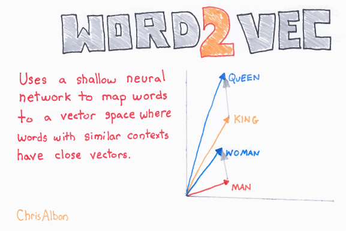

Word Embeddings
===============

**Word Embeddings transform text into a sequence of vectors.**

Background
----------

Word Vectors
~~~~~~~~~~~~

**Word vectors** are dense representations of words (in contrast to a huge sparse binary matrix), that allows to feed text into neural networks.

A **Word embeddings** is the transformation of all input words into word vectors.

This approach is also referred to as **Word2Vec**.

Skip-Grams
~~~~~~~~~~

**Skip-grams** are simply pairs of words that are 1 or more words apart.
Skip grams are frequently used to calculate word embeddings:

.. image:: skip_grams.png
   :alt: http://mccormickml.com/assets/word2vec/training_data.png

1.  Tokenizing the data follows the same principles as in a Bag-of-words. To represent spatial relationships between words.
2.  Consider words and their context by generating pairs of words up to N words apart.
3.  Count the co-occurence of words *X* (a huge sparse matrix)
4.  Optimize a loss function for the word vectors *w* over words *i* and *j*

.. math::

   J \approx \sum_{ij}(w_i^T w_j - log X_{ij})^2

.. container:: banner reading

   Pretrained embeddings

.. highlights::

   Because calculating a word embedding from scratch is costly (millions of
   tokens, 1 million parameters and more), it is often useful to start with
   pretrained word embeddings:

   -  `BERT (state-of-the-art in 2019) <http://jalammar.github.io/illustrated-bert/>`__
   -  `GloVe (Stanford) <https://nlp.stanford.edu/projects/glove/>`__.
   -  `Gensim / Doc2Vec <https://radimrehurek.com/gensim/index.html>`__ – applies the embedding principle to text paragraphs
   -  :ref:`spacy` also has pretrained Word Vectors.

Embedding Layers
~~~~~~~~~~~~~~~~

An embedding layer transforms one-hot encoded input (usually with a huge
number of dimensions) to much fewer dimensions, e.g. representing a word
as a 50 or 200-dimensional vector.

There are plenty of uses and architectures for Word Embeddings. The majority of these have an Embedding Layer either as the first layer (to understand text) or as the last layer (to produce text).

Here is a typical architecture

To condense the information in a longer text sequence, you can use one
or more **1D convolutional layers**.

Cosine Similarity
~~~~~~~~~~~~~~~~~

You can compare word vectors using the cosine similarity:

.. literalinclude:: cosine_sim.py

Embeddings for other types of data
~~~~~~~~~~~~~~~~~~~~~~~~~~~~~~~~~~

Embeddings can be used for other types of sparse data as well, e.g. to
build recommender systems (see the parallel to NMF).

.. container:: banner reading

   Links

.. highlights:

   -  `Introduction to Word Embeddings <http://ruder.io/word-embeddings-1/index.html>`__ – by Sebastian Ruder
   -  `GloVe algorithm <http://text2vec.org/glove.html>`__
   -  https://medium.com/@thoszymkowiak/how-to-implement-sentiment-analysis-using-word-embedding-and-convolutional-neural-networks-on-keras-163197aef623
   -  `TensorFlow Word2Vec tutorial <https://www.tensorflow.org/tutorials/word2vec>`__
   -  `NLTK <http://www.nltk.org/>`__ – general purpose text processing library

   Video on word vectors:

   .. youtube:: _YYQNpjvvLE

--------------

Examples
--------

Create GenSim Vectors
~~~~~~~~~~~~~~~~~~~~~

.. literalinclude:: build_gensim.py

Download Pretrained GenSim Vectors
~~~~~~~~~~~~~~~~~~~~~~~~~~~~~~~~~~

.. warning::

   This is a 4 GB file that will be loaded to memory.
   It will require a lot of RAM.

.. literalinclude:: download_gensim.py

Similarity of Words
~~~~~~~~~~~~~~~~~~~

.. literalinclude:: similar_words.py

Vector Addition
~~~~~~~~~~~~~~~

.. literalinclude:: vector_addition.py

.. seealso::

   The code examples above are adopted from the *Deep Learning Cookbook by Douwe Osinga* (`https://github.com/DOsinga/deep_learning_cookbook <https://github.com/DOsinga/deep_learning_cookbook>`__).

Exercises
---------

Exercise 1
~~~~~~~~~~

Load a set of pretrained word vectors into a Python program.

Exercise 2
~~~~~~~~~~

Calculate **cosine similarities** between pairs of words.

Exercise 3
~~~~~~~~~~

Calculate the word vector resulting from

::

   glove - hand + foot

Calculate the cosine similarity between the resulting vector and what you think might be the real answer.

Exercise 4
~~~~~~~~~~

Calculate cosine similarities between word pairs like `(eagle, good)` to find out whether there are good or evil animals.

How do you interpret the results?
