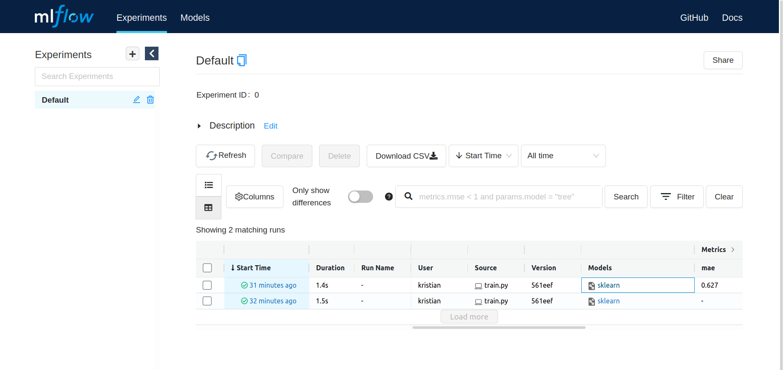

MLFlow
======

MLFlow is a tool to record, version and deploy models.

Here you find a concise step-by-step guide to make a first impression.

Installation
------------

MLFlow is easy to install with `pip`:

::

   pip install mlflow

For deploying models to production, you should install the `conda` environment. 
But `conda` is not required if you would like to just try MLFlow.

There are plenty of code examples in the official repository:

::

   git clone https://github.com/mlflow/mlflow

Train a Model
-------------

Lets run one of the examples that trains a Scikit model (`see source code <https://github.com/mlflow/mlflow/blob/master/examples/sklearn_elasticnet_wine/train.py>`__):

::

   cd mlflow/examples

   python sklearn_elasticnet_wine/train.py

   ls

You should see that a folder `mlruns/` has been created. Here the training scores and metadata are stored
(in production, you would want to use a **relational DB** for that).

Start the Dashboard
-------------------

To inspect the models, start the web interface:

::

   mlflow ui

and go to `localhost:5000 <localhost:5000>`__.

It should look like this:

Serve a Model
-------------

Lets train another that is accessible through a HTTP interface (`see source code <https://github.com/mlflow/mlflow/blob/master/examples/sklearn_logistic_regression/train.py>`__):

::

   python sklearn_logistic_regression/train.py

You should see a message like:

::

   Score: 0.6666666666666666
   Model saved in run 5b0634f7a5ed4873b21e7f6d57a360c4

Copy the hash code and insert it as `<RUN_ID>` in the next command:

   mlflow models serve --no-conda -m runs:/<RUN_ID>/model

You should see a log message like:

::

   [2022-03-17 08:42:42 +0100] [399319] [INFO] Booting worker with pid: 399319

.. note::

   Do not interrupt the MLFlow server. We still need it in the next step.

Use the model
-------------

You can access the model through the HTTP interface from a Unix command line:

::

   curl -d '{"columns":["x"], "data":[[1], [-1]]}' -H 'Content-Type: application/json; format=pandas-split' -X POST localhost:1234/invocations

or with Python:

.. code:: python3

   import requests
   
   url = "http://localhost:5000/invocations"
   data = {"columns":["x"], "data":[[1], [-1]]}
   
   r = requests.post(url, json=data)
   
   r.status_code
   r.text
   
.. note::

   The model uses a single input feature. The first `[1]` is the ID of the data point.

.. container:: banner reading

   Further Reading

.. highlights::

   `mlflow.org <https://mlflow.org/docs/latest/index.html>`__ - official MLFlow homepage
