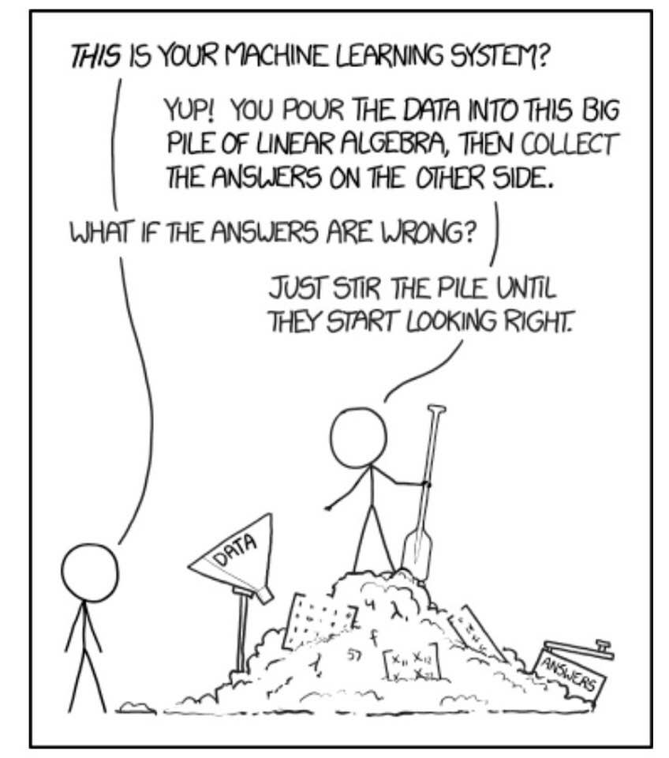
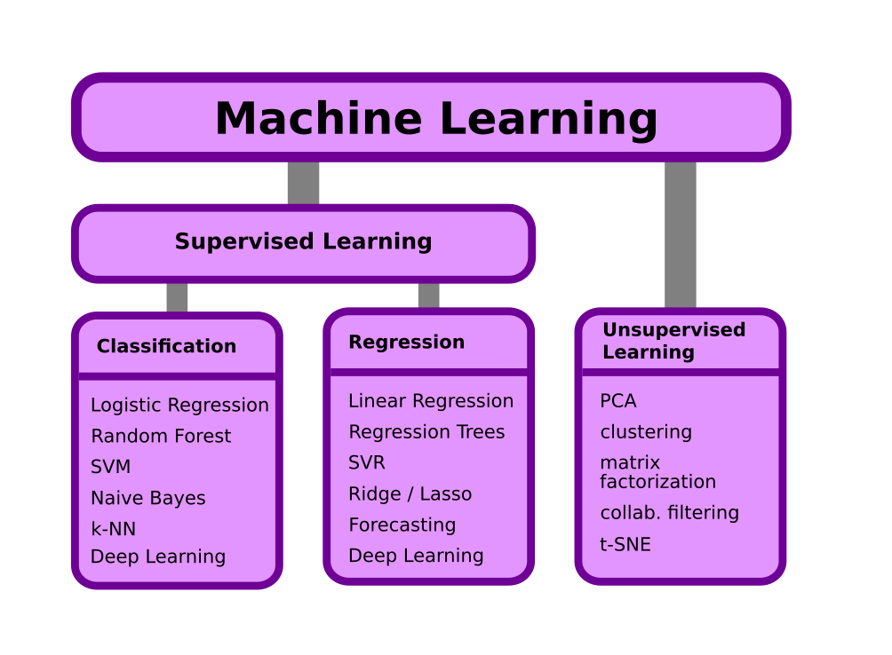

What is Machine Learning?
=========================

.. container:: banner question

   Why Machine Learning?

.. highlights::

   Briefly discuss reasons why you might want to apply Machine Learning to a business problem.

Definition
----------

.. highlights::

   "A program is said to learn from experience E
   with respect to some class of tasks T
   and performance measure P,
   if its performance at tasks in T as measured by P,
   improves with experience E."

   *(Tom Mitchell, 1997)*

.. figure:: ml_overview.png

Core Concepts
-------------

====================== ====================================================
concept                description
====================== ====================================================
Model                  a program that generates :math:`\hat y` from *X*
Model Parameter        this is what the program *"learns"* from the data
Metric                 a performance measure of the model quality
Hyperparameter         a number that we have to set before training
Supervised Learning    we know the input data *X* and correct answers *y*
Classification         *y* are categories
Regression             *y* is a scalar
Unsupervised Learning  we know *X* but not *y*
====================== ====================================================

The most important Machine Learning methods
-------------------------------------------

In **Supervised Learning** we know the correct answers for some example data.
The model is predicting an output value :math:`\hat y` based on an input *X*.
Supervised learning has two subtypes: **Classification** and **Regression**.

In Classification, we want to predict a category. In Regression, we want to predict a scalar.

In **Unsupervised Learning** we have input data *X*, and examine the structure of the data without knowing what the outcome should be.

Some ML methods are quite old
-----------------------------

=========================== ====
method                      year
=========================== ====
Linear Regression           1805
Artificial Neural Networks  1954
Logistic regression         1958
Hidden Markov Model         1960
Stochastic gradient descent 1960
Support Vector Machine      1963
k-nearest neighbors         1967
Decision tree               1986
Random forest               1995
=========================== ====

Model Diversity
---------------

The **No Free Lunch Theorem** states: There does not exist a single perfect model that applies to all problems.

.. figure:: classifier_comparison.png
   :alt: Classifiers in Scikit-Learn

   Decision Boundaries of classifiers in Scikit-Learn `source: scikit-learn.org <http://scikit-learn.org/stable/auto_examples/classification/plot_classifier_comparison.html>`__
   

.. container:: banner challenge1

   Classification, Regression or Unsupervised?

.. highlights::

   Consider the following 5 business cases.
   In terms of ML, are they classification, regression or unsupervised problems?

   ----

   **A) Sales Forecast**

   To place orders in time, you would like to estimate how much of a given item you will sell a year from now.
   You know how many items were sold per day during the past 3 years. 
   There are 10,000 different items.

   ----

   **B) Credit Card Fraud**

   You have 100M credit card transactions. Out of these 10,000 turned out to be fraud attempts that have been cancelled.
   You would like to identify the fraudulent credit card transactions.

   ----

   **C) Driving Assistant**

   You want to build a device that warns a driver if there is a bicycle on the assistants camera.
   You have 100,000 camera images on which the bicycles have been labeled manually.

   ----

   **D) Book Store**

   You want to display potentially interesting books to visitors of your online book store.
   To do so, you would like to segment your 50,000 customers into groups based on their 
   purchase history, behavior on the website and social media profile.

   ----

   **E) Hotel Reviews**

   You have 10000 hotel reviews in free text and a star rating (1-5). 
   You have another 10000 reviews for which you have only the text and would like to find out the star rating.

