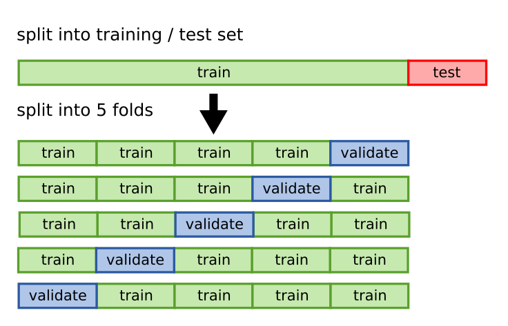
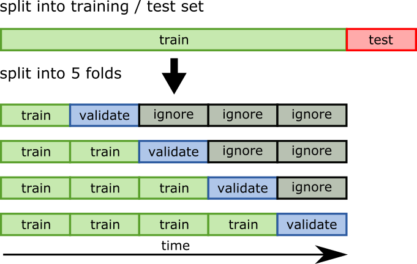

.. _crossval:

Cross-Validation
================

Concepts
--------

=========================================================== ==============================
Function
=========================================================== ==============================
:py:func:`sklearn.model_selection.cross_validate`           k-fold cross-validation
:py:class:`sklearn.model_selection.ShuffleSplit`            Shuffle-split cross-validation
:py:class:`sklearn.model_selection.StratifiedShuffleSplit`  stratified Shuffle-split CV
:py:func:`sklearn.utils.resample`                           Select sample from dataset
=========================================================== ==============================

K-fold Cross-Validation
-----------------------

**K-fold Cross-Validation** divides the dataset into *k* portions called **folds**. 
Each fold serves as a test dataset once, and the rest as a training set.
This results in a table of *k* scores for the training and test fold 
that allow to evaluate the robustness of the model.

With cross validation we can use all our training data for fitting the model as we don't need to
apply an additional train-validation split. On the other side, cross validation is computationally costly, 
especially for large datasets. 

.. code:: python3

   from sklearn.model_selection import cross_validate

   model = LinearRegression()
   cv = cross_validate(model, X_train_trans, y_train, 
                       cv=5,
                       scoring='r2', 
                       return_train_score=True
   )
   # convert the dictionary of lists into a DataFrame
   cv = pd.DataFrame(cv)
   print(cv)

.. container:: banner milestone

   Cross-Validation with the Mean Squared Log Error

.. highlights::

   Try 5-fold cross-validation with `scoring='neg_mean_squared_log_error'` on the Bike dataset.

   How would you interpret the result?

Shuffle-Split
-------------

**Shuffle-Split** is a more flexible alternative, especially with large datasets. It allows you to select random samples with a specific size.
The **stratified** variant takes care to select representative features.

.. container:: banner challenge2

   Cross-Val vs. Shuffle-Split

.. highlights::

   Compare **k-fold CV** and **Shuffle-split CV** on the Titanic dataset.
   What impact does the size of the dataset have?
   What impact does stratification have?

Cross-Validation and Time Series Data
-------------------------------------

In time series, we try to **predict the future from the past**.
Because of that, the test data always has to be *after* the training portion.
In this case, cross-validation should look like this:

There is no scikit function for that, you need to slice the data folds yourself.

.. container:: banner reading

   Further Reading

.. highlights::

   **Evaluating Model Fit:**
   
   .. youtube:: xS4jDHQfP2o

.. container:: banner recap

   Recap Questions

.. highlights::

   -  What is a sampling bias?
   -  What is the purpose of a validation set?
   -  Why is a single validation set not sufficient?
   -  What does it mean if your cross-validation scores fluctuate a lot?
   -  What is stratification?
