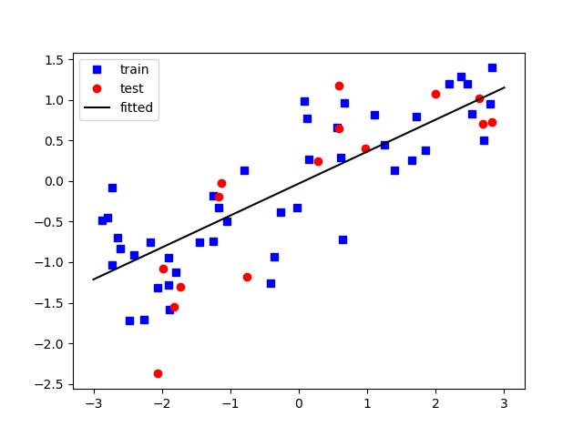

.. _linreg:

Linear Regression
=================

In regression, we are predicting a **scalar value** from one or more features.

Linear Regression models
------------------------

Linear Regression is a straightforward model. 
The basic idea is to fit a straight line to the data points.

.. math::

    \hat{y} = w_0 + w_1 x

- :math:`w_0` is called the **intercept** (or **bias**)
- :math:`w_1` is called the **slope** (**weight** or **coefficient**)

However, if you have multiple features, you would fit a plane or hyperplane instead.
With ``p`` features :math:`x_1, x_2 .. x_p`, each of them has one
**coefficient** :math:`w_1, w_2, ..., w_p` associated with it.
The model then becomes a weighted sum with a **parameter vector** :math:`w`:

.. math::

    \hat{y} = w_0 + w_1 x_1 + w_2 x_2 + \dots + w_p x_p

This equation can be written in a *vectorized* form, reducing the equation to a **dot product**:

.. math::

   \hat{y} =  \boldsymbol{X} \cdot \boldsymbol{w^T}

Evaluation Metrics
------------------

For calculation, the **Mean Squared Error (MSE)** is most commonly used.
The MSE is deeply rooted in the probability theory of linear models:

.. math::

   MSE = \frac{1}{n}\sum_{i=1}^{n}(y_i-\hat{y}_i)^2

The MSE is deeply rooted in probability theory and helps to find the *most likely* model.
However, the **Mean Absolute Error (MAE)** is easier to interpret.
The MAE has the same unit as the target variable:

.. math::

   MAE = \frac{1}{n}\sum_{i=1}^{n}abs(y_i-\hat{y}_i)

The **coefficient of determination** :math:`R^2` tells you how much of the variance in your response can be explained by your features. 
So, a :math:`R^2` of 1.0 means your model has a perfect fit – no errors in your predictions!
On the other hand, a :math:`R^2` of 0.0 means your model is no better than a **simple average** over all points.
You can also think of this as comparing your predictions to the **simplest possible prediction: the average**.

.. math::

   R^2 = 1 - \frac{SSE}{SS_{total}} = 1 - \frac{\sum_{i=1}^n(y_i-\hat{y_i})^2}{\sum_{i=1}^n(y_i-\overline{y})^2}

How to fit a Linear Regression model?
-------------------------------------

Linear models are generally easy to solve and very fast. There is an
equation called the **Normal Equation** that finds the parameter
analytically (also called *closed form solution*).

.. math::

   \hat{w} = \frac{X^Ty}{X^TX}

However, the time to compute the normal equation grows to the power of 3 with the number of data points. For many data points and/or features, the normal equation becomes very slow.
Also, it runs into a math dilemma (a non-invertible matrix) if the features are redundant or linearly dependent.

The alternative, **Gradient Descent** does also find optimal parameters.
It starts with a **random guess** and performs minimization steps until it reaches optimal values for the coefficients.

Gradient Descent
----------------

.. highlights::

   The Gradient Descent algorithm works like this:

   1. set all model coefficients to random values
   2. calculate the partial derivative of the loss function (the MSE) by each coefficient (the Jacobian). This is also called the **gradient** :math:`\triangledown loss(\omega)`
   3. multiply the derivatives with a **learning rate** :math:`\eta`
   4. modify the coefficients by the modified derivatives
   5. repeat steps 2-4 until the algorithm converges

   The key equation for calculting the weight modification :math:`\triangle \omega` is:

   .. math::

      \triangle \omega = -\eta \triangledown loss(\omega)

Terminology
-----------

======================== ==================================================
concept                  description
======================== ==================================================
OLS                      Ordinary Least Squares, another name for Linear Regression
Normal Equation          analytical solution for Linear Regression (slow)
Gradient Descent         algorithm that finds a solution iteratively
MSE                      Mean Square Error
MAE                      Mean Absolute Error
GLM                      Generalized Linear Model, superfamily of OLS
Polynomial Regression    fitting polynomial features
======================== ==================================================

Example with Scikit
-------------------

.. literalinclude:: ex_linear_model.py

.. container:: banner reading

   Further Reading

.. highlights::

   With good feature engineering, Linear Regression becomes a very strong technique for a variety of applications:

   .. youtube:: https://www.youtube.com/watch?v=68ABAU_V8qI

Example with Statsmodels
------------------------

The ``statsmodels`` library gives you much more detailed output than scikit.

.. code:: python3

   X['intercept'] = 1

   m = OLS(endog=y, exog=X)
   r = m.fit()

   print(r.summary())
   ypred = r.predict(X)

Alternatively, you can specify an equation:

.. code:: python3

   m = OLS.from_formula('cnt ~ temp**2 + hum + windspeed', data=df)

.. container:: banner recap

   Recap Questions

.. highlights::

   -  Can you use Linear Regression with millions of data points?
   -  Can you use Linear Regression with millions of features?
   -  Which training algorithms exist and what are their pros and cons?
   -  Does it help to scale the date in Linear Regression?
   -  How do Generalized Linear Models (GLMs) differ from linear regression?

----

.. note::

   The exercise questions were adopted from: *Hands-On Machine Learning
   with Scikit-Learn and TensorFlow by Aurélien Géron. Publisher: O'Reilly
   Media. 2017.*

   Some text and equations were adopted from work by Daniel Voigt Godoy, CC-BY 4.0.

