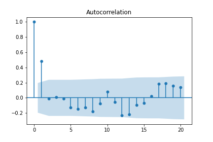
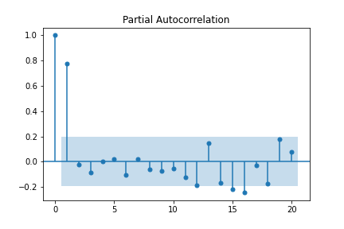
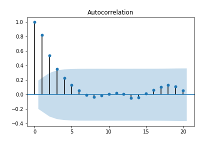
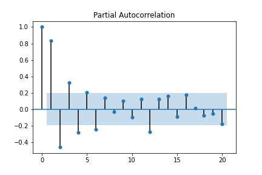

Autoregressive-Integrated-Moving-Average Model (ARIMA) 🌶
=========================================================

.. container:: banner warmup

   How many lags?

.. highlights::

  **1. Load the** :download:`file <./arma_process.csv>`
  
  **2. Plot the data.**

  .. figure:: arma_process.png

  **3. Use** ``plot_pacf`` **from** ``statsmodels.graphics.tsaplots`` **to inspect the partial autocorrelations.**

  **4. How many lags should we include?**

An ARIMA process is an extension of the autoregressive process. It has the form:

.. math::

   y_t = w_0 + \epsilon_t + \sum_{j=1}^{P}w_{j}y_{t-j} + \sum_{i=1}^{Q}\phi_{i}\epsilon_{t-i}

where :math:`w_0` is the bias/intercept, the w's are the coefficients of the autoregressive part of the model,
the :math:`\phi` s are the coefficients of the moving average part and :math:`\epsilon` is
some iid (e.g. Gaussian) noise. For the noise it holds that

.. math::

  E(\epsilon_t) = E(\epsilon) = 0,

  V(\epsilon_t) = V(\epsilon) = \sigma^2

.Expectation and variance are constant and time invariant.

For the case of p=1 and q=1 we can write the process as:

.. math::

  y_t = w_0 + \epsilon_t + w_1y_{t-1} + \phi_1\epsilon_{t-1}

This is called an ARIMA(1,0,1) process where the order is (p,d,q). *d* is the order of differencing that is applied to
the original time series.

Autocorrelation
---------------

One way to characterize the time dependence in a time series is by the
correlation between :math:`y_t` and :math:`y_{t-h}`, defined as

.. math::

   Corr(y_t, y_{t-h}) = \frac{Cov(y_t, y_{t-h})}{\sqrt{V(y_t)*V(y_{t-h})}}

Partial Autocorrelation
-----------------------
A complementary measure of time dependence is the so-called partial-autocorrelation
function (PACF), which is the correlation between :math:`y_t` and :math:`y_{t-h}`, conditional
on the intermediate values, i.e.

.. math::

   \delta_h = Corr(y_t, y_{t-h}|y_{t-1}, ..., y_{t-h+1})

Model Selection
---------------

We have seen that the autoregressive order can be determined by looking at the Partial 
Autocorrelation (how many lags of the variable of interest to include).
The order of the moving average part can be determined by looking at the Autocorrelation. 
If there is a sharp drop in the autocorrelation plot at lag *q* this indicates that we are dealing with an MA(q) process.

.. code:: python3

   from statsmodels.graphics.tsaplots import plot_acf

   print(plot_acf(y))

For the AR process, the last lag before the partial autocorrelation
plot cuts off is the number of lags that we might want to use as p value in
our AR(P) model.

.. code:: python3

   from statsmodels.graphics.tsaplots import plot_pacf

   print(plot_pacf(y))

If we are dealing with an ARMA process we will not see any cut offs and it will therefore be more difficult to determine the order.

.. code:: python3

   from statsmodels.graphics.tsaplots import plot_acf, plot_pacf

   print(plot_acf(y))

.. code:: python3

   print(plot_pacf(y))

In that case we have to look at evaluation metrics to decide which model to use.

.. container:: banner challenge1

   Examine (Partial) Autocorrelations

.. highlights::

   Plot both, the autocorrelation and the partial autocorrelation of:

   -  random noise
   -  a random walk
   -  a perfect linear function
   -  a periodic function (:math:`sin(x)` with x in degrees)

   What do you observe?

.. container:: banner challenge1

   Use AutoARIMA

.. highlights::

   Use ``auto.arima`` from the `pmdarima <https://alkaline-ml.com/pmdarima/index.html>`__ library to select your model.
