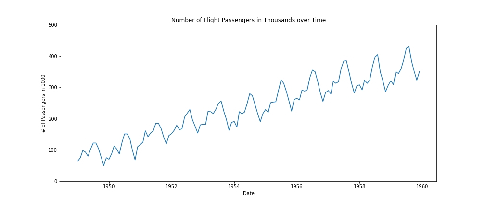
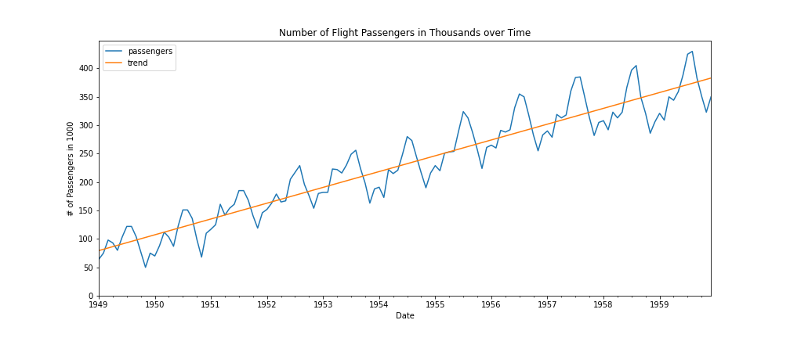
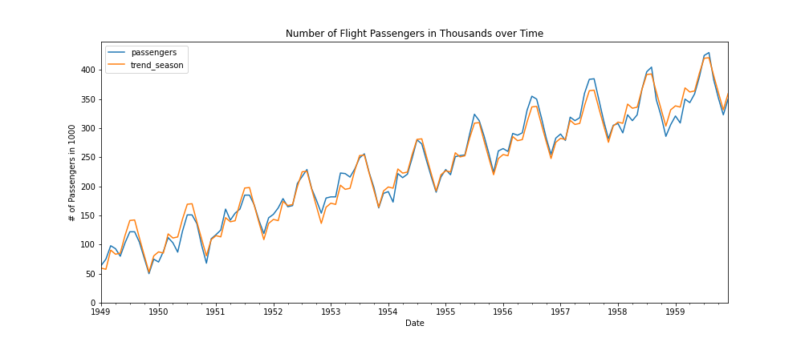
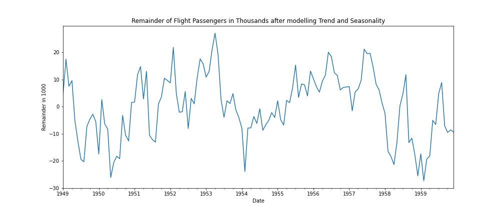

Analyzing Time Series
=====================

.. container:: banner warmup

   Temperature Forecast I

.. highlights::

  Discuss the following questions:

   1. What does the temperature forecast for Berlin for any given day depend on?

   - The year? Is there an underlying trend the temperature follows?
   - The day of the year? Does the temperature depend on the season of the year?
   - The temperature of the previous day? Is the present able to explain part of the (near) future?

   1. If we know the day of the year, the year and the temperature of the previous
   day, are we able to perfectly predict the temperature of any given day in Berlin?

Time Series Data
----------------

"An obvious characteristic of time series data that distinguishes it from
cross-sectional data is **temporal ordering**." - Introductory Econometrics, J. Wooldridge

Components
----------

Time series data can have the following components:

#. Trend
#. Seasonality
#. Remainder - Time Dependence and Randomness

Time Series Analysis
--------------------

Time Series Analysis is a field of statistical analysis that deals with modeling
**time dependence**.

.. _temperature_components:

.. container:: banner milestone

   Model a time series

Step 1 - Load the Data
~~~~~~~~~~~~~~~~~~~~~~

- Load the dataset :download:`flights_train.csv <../flights_train.csv>` as a pandas `DataFrame`.

- Inspect the size of the data and the column types and missing values (if present).

Step 2 - Plot the time series
~~~~~~~~~~~~~~~~~~~~~~~~~~~~~

We expect to see something like this:

Step 3 - Model the trend
~~~~~~~~~~~~~~~~~~~~~~~~~~~~~

In time series data it is common to see a **trend**. The trend can be upward or
downward sloping, it can be linear or polynomial.

**How can we model a linear trend?**

If the original values follow a linear trend we can model the trend in the following way:

- Create a new feature named ``timestep``

.. code:: python3

  flights['timestep'] = list(range(len(flights)))

- Use that feature as your ``X``
- Use the passenger number ``flights['passengers']`` as y
- Run a linear regression

**How can we model a polynomial trend?**

If the original values follow a polynomial trend we can model that by using ``PolynomialFeatures`` from ``sklearn``.

.. hint::

  To find out what kind of trend we are dealing with, we will first visualize
  the time series data.

  If we are unsure, we can run a linear regression with a timestep as input feauture and
  another one including a polynomial timestep. We then observe which regression seems to
  fit better to the data. You can use statsmodels.api.OLS for this.

Step 4 - Plot the original data and the trend
~~~~~~~~~~~~~~~~~~~~~~~~~~~~~~~~~~~~~~~~~~~~~

We expect to see something like this:

Step 5 - Model the seasonality
~~~~~~~~~~~~~~~~~~~~~~~~~~~~~~

Once we have modeled the trend, the easiest way to model the seasonality is to
create dummy features for each season.

.. code:: python3

  seasonal_dummies = pd.get_dummies(flights.index.month,
                                    prefix='month',
                                    drop_first=True).set_index(flights.index)

  flights = flights.join(seasonal_dummies)

Now we can do the following:

- Use the timestep feature and the seasonal dummies as X
- Use ``flights['passengers']`` as y
- Run a linear regression

Step 6 - Plot the original data and the trend + seasonality
~~~~~~~~~~~~~~~~~~~~~~~~~~~~~~~~~~~~~~~~~~~~~~~~~~~~~~~~~~~

We expect to see something like this:

Step 7 - Extract the remainder
~~~~~~~~~~~~~~~~~~~~~~~~~~~~~~

- Extract the remainder by subtracting the model of the trend and the seasonality from the original passenger data.
- Plot the remainder

We expect to see something like this:

Step 8 - Save the remainder in a .csv file
~~~~~~~~~~~~~~~~~~~~~~~~~~~~~~~~~~~~~~~~~~

This remainder is what we will try to model in the next lectures.

.. container:: banner challenge2

   Model the temperature data

.. highlights::

   Go through the same steps for the temperature data. Ask yourself the questions:

   - How should I model the trend?
   - How should I model the seasonal component?

.. container:: banner challenge3

   Model a multiplicative Time Series

.. highlights::

   Go through the same steps for the original flights dataset from ``seaborn``

   .. code:: python3

      flights = sns.load_dataset('flights')

   You will have to apply some extra steps like converting the time information to a ``pd.Timestamp`` and setting it as the index.

   - What difference do you observe with regard to the remainder?
   - Try to log transform the passenger data and then extract the remainder. What do you observe?

----

.. container:: banner reading

   Further Reading

.. highlights::

   `Time Series Analysis in Python <https://towardsdatascience.com/time-series-analysis-in-python-an-introduction-70d5a5b1d52a>`__
   `Time Series Analysis Course at KU Denmark <https://absalon.ku.dk/courses/21267/pages/information-about-the-course>`__
