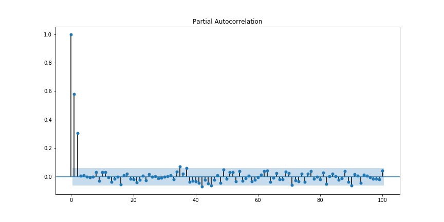

Autoregressive Model (AR)
=========================

As mentioned in Analyzing Time Series
we are from now on mainly concerned with the Remainder
of the time series after modelling the trend and seasonality.

.. figure:: ./images/remainder.png

.. container:: banner warmup

   Shifting Rows

.. highlights::

   In forecasting, we want to predict the future from the present.

   **1. Load the** :download:`flights_remainder.csv <./data/flights_remainder.csv>`

   .. code:: python3

      df = pd.read_csv('flights_remainder.csv')

   **2. Create a time-lagged input feature:**

   .. code:: python3

      df['lag1'] = df['remainder'].shift(1)

   **3. Calculate the correlation coefficient between the time-lagged and the original remainder**

   **4. Create a scatterplot with** ``df['lag1']`` **on the x-axis and** ``df['remainder']`` **on the y-axis**

   **5. Try the same for lag2 and lag3**

   Shifting rows is very useful for time-series analysis when you want to use
   time-lagged features as inputs to a predictive model.

An autoregressive process is a stochastic process of the form:

.. math::

  y_t = w_0 + \sum_{j=1}^{P}w_{j}y_{t-j} + \epsilon_t

where :math:`w_0` is the bias/intercept, the w's are the weights of the model and :math:`\epsilon` is
some iid (e.g. Gaussian) noise. For the noise it holds that

.. math::

  E(\epsilon_t) = E(\epsilon) = 0,

  V(\epsilon_t) = V(\epsilon) = \sigma^2

.Expectation and variance are constant and time invariant.

For the case of p=1 we can write the process as:

.. math::

  y_t = w_0 + w_1y_{t-1} + \epsilon_t

This is called an AR(1) process. Note that this is the same model specification
as in the case of linear regression, just on lagged realizations of the
same variable. Therefore, in general we will also rely on the same assumptions
in order to be able to use AR-Models. However, we have to introduce two more
assumptions that are specific for time series models.

Assumptions
-----------

On top of the assumptions of linear regression, we include two more assumptions:

Weak Stationarity
~~~~~~~~~~~~~~~~~

For AR and ARIMA models to work we need stationary time series.
Stationarity means that the statistical properties of the series do not depend on the
time at which the series is observed. In other words, a time series is
stationary if the expectation and variance do not change over time.
In the long run, a stationary time series is not predictible.

Non-stationary time series can be transformed into stationary time series data by:

- taking first (or higher order) differences to stabilize the mean
- transformations (e.g. log) can help to stabilize the variance
- taking out seasonality

Weak Dependence
~~~~~~~~~~~~~~~

"A stationary time series process [...] is said to be weakly dependent if
:math:`x_t` and :math:`x_{t-h}` are "almost independent" as h" goes to infinity.
"In other words, as the variables get farther apart in time, the correlation
between them becomes smaller and smaller." -
Introductory Econometrics - Wooldridge, J.

Autocorrelation
---------------

One way to characterize the time dependence in a time series is by the
correlation between :math:`y_t` and :math:`y_{t-h}`, defined as

.. math::

   Corr(y_t, y_{t-h}) = \frac{Cov(y_t, y_{t-h})}{\sqrt{V(y_t)*V(y_{t-h})}}

Partial Autocorrelation
-----------------------
A complementary measure of time dependence is the so-called partial-autocorrelation
function (PACF), which is the correlation between :math:`y_t` and :math:`y_{t-h}`, conditional
on the intermediate values, i.e.

.. math::

   \delta_h = Corr(y_t, y_{t-h}|y_{t-1}, ..., y_{t-h+1})

Model Selection
---------------

In order to select the model specification we want to look at the partial
autocorrelation of the time series. The last lag before the partial autocorrelation
plot cuts off is the number of lags that we might want to use as p value in
our AR(P) model.

.. code:: python3

   from statsmodels.graphics.tsaplots import plot_pacf

   print(plot_pacf(y))

