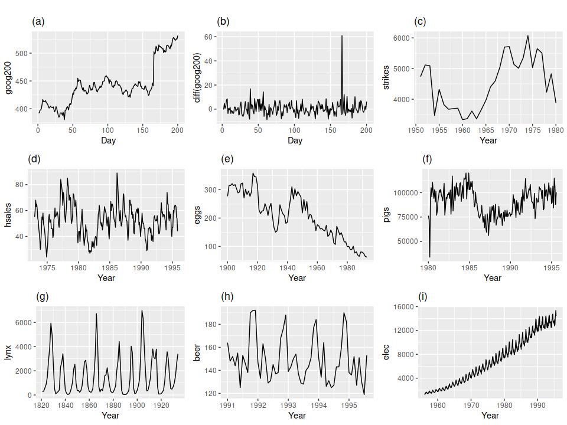
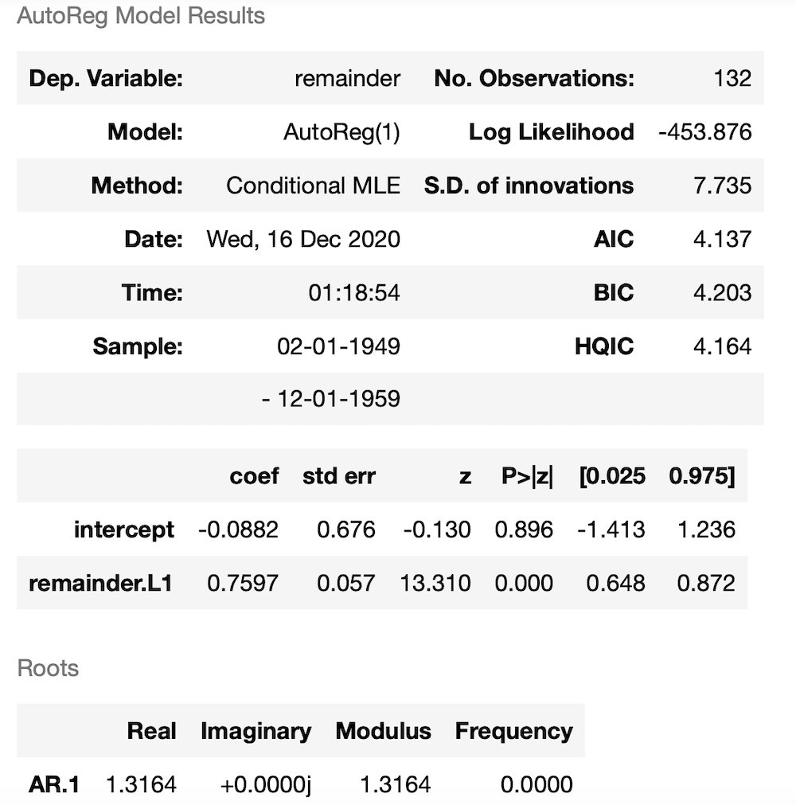

Statistics of Time Series
=========================

Stationarity
############

In order to model your time series, you want it to be stationary.
This ensures that every value is drawn from the same distribution
so it's statistical properties don't change over time. This allows
you to model nearby data points for short term prediction.
For long term prediction, you can use patterns like trend and
seasonality.

**Strict stationarity:** Your time series is completely time invariant.

**Weak stationarity:** The mean and variance do not change over time but auto-covariance depends on the time distance n between the steps t-n and t, rather than their absolute positions, so it can still be modelled as the same distribution.

**Trend stationary:** It has a predictable trend. In this case, the overall mean trend equals the trend between consecutive steps.

For our remainder, it is enough to be weakly stationary.

*Figure is from "Forecasting Principles and Practice" by Rob J. Hyndman and Georges
Athanasopoulos, `Chapter 8.1`_*

.. _Chapter 8.1: https://otexts.com/fpp2/stationarity.html

.. container:: banner warmup

   Stationarity

.. highlights::

   Which of the above series are stationary?
   (a) Google stock price for 200 consecutive days;

   (b) Daily change in the Google stock price for 200 consecutive days;

   (c) Annual number of strikes in the US;

   (d) Monthly sales of new one-family houses sold in the US;

   (e) Annual price of a dozen eggs in the US (constant dollars);

   (f) Monthly total of pigs slaughtered in Victoria, Australia;

   (g) Annual total of lynx trapped in the McKenzie River district of north-west Canada;

   (h) Monthly Australian beer production;

   (i) Monthly Australian electricity production.

Hypothesis Testing
##################

When you sample all possible events from a distribution functions, some of these events will be further away from the centre. These have very low p values (p<0.05) which indicates that an extreme, and usually unexpected event happened. In that case the significance of the event is higher and you reject the null hypothesis that nothing special is happening with it.

Augmented Dicker-Fuller Test
############################

The augmented Dickey-Fuller test is a statistical method to test the
stationarity of a time series. Its null hypothesis is that there is a unit
root, ie. the time series is not stationary. Hence to reject the null
hypothesis, we need the p < 0.05.

.. _adf_test:

.. container::

   Run a Dickey Fuller test on the decomposed parts of a time series, to test
   for stationarity.

   .. code::

      import numpy as np
      gaussian_noise = np.random.normal(size=1000)
      statsmodels.tsa.stattools.adfuller(gaussian_noise)

   Check the output of the code. What is the significance of the first and second
   values? Is the Gaussian data stationary? (Hint: Check the documentation out
   `https://www.statsmodels.org/0.6.1/generated/statsmodels.tsa.stattools.adfuller.html`)

Statistics of the Autoregressive Model
######################################

The statsmodels package gives very detailed output about its model's
performance. Check the below results from an autoregressive model in statsmodels.

* Likelihood is a measure of the goodness of fit for your model to the data. "How likely is your data coming from this process?" Why is the log likelihood negative?
* A small p value means that the value is significant. The a cut-off of 0.05 (5%) is typical for the p value. In the above the high p value for the intercept suggests that we should probably try to improve the model.
* The values [0.025 0.975], to dividing the 0.05 cut off to two sides of the distribution and corresponds to the 95% confidence level for both parameter values.
* In time series, the innovation is the difference between the observed value and the forecast based on the past. (S.D: standard deviation).
* AIC is the Akaike Information Criterion. AIC = 2k - 2log(L). We want to minimise it and this will happen for the smaller number of parameters and larger likelihood.
