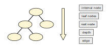
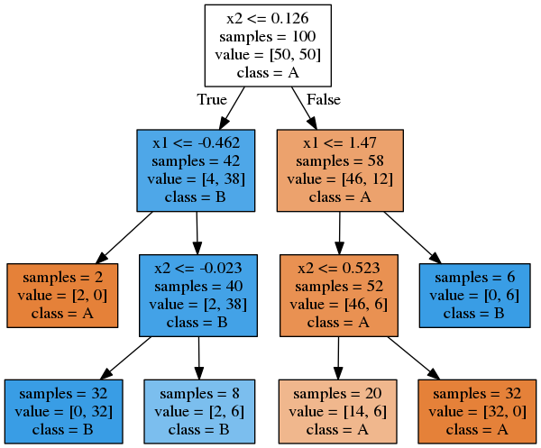

.. _decision_trees:

Decision Trees
==============

Exercise: Place the concepts
----------------------------

Key Concepts
------------

======================= ==============================================
concept                 description
======================= ==============================================
decision tree           a classification model constructing questions
root node               the first question a tree asks
leaf node               the result of the last question
depth                   number of consecutive questions
CART                    name of the tree construction algorithm
GINI                    a metric for the purity of nodes
======================= ==============================================

The GINI index
--------------

The **GINI index** is used to evaluate which partition results in the best separation of the classes ``K``:

.. math::

    GINI = \sum_{k=1}^{K}{(p_k (1 - p_k))}

Where *p* indicates the proportion of points belonging to class *K*.

**Which is the best possible GINI score, which the worst?**

The CART Algorithm
------------------

-  finds out which if statements give the best separation
-  it is a **divide-and-conquer** algorithm
-  it is a **greedy** algorithm
-  as a metric, the GINI purity score

.. highlights::

   **The Algorithm**

   1. For each feature, determine the best threshold for splitting
   2. Determine the best feature-threshold pair
   3. Create two child nodes
   4. Split the data points across child nodes
   5. For each node, start again from 1.
   6. If subset is pure or `max_depth` is reached **STOP**

Decision Trees in Scikit-learn
------------------------------

.. code:: python3

   from sklearn.tree import DecisionTreeClassifier

   m = DecisionTreeClassifier(max_depth=4)
   m.fit(Xtrain, ytrain)
   print(m.score(Xtrain, ytrain))

   print(m.score(Xval, yval))

.. hint::

   Try different values for the `max_depth` hyperparameter. 
   What effect does it have on the score?

Plotting Decision Trees
-----------------------

One advantage of Decision Trees is that scikit can plot them easily:

.. code:: python3

   from sklearn.tree import plot_tree

   plot_tree(model)

.. seealso::

   -  `A simple explanation of Gini impurity <https://victorzhou.com/blog/gini-impurity/>`__
   -  `Decision Tree infographic <https://github.com/Avik-Jain/100-Days-Of-ML-Code/blob/master/Info-graphs/Day%2023.jpg>`__
   -  `scikit documentation for Decision Tree models <https://scikit-learn.org/stable/modules/tree.html>`__
   -  `paper on classification and regression trees <http://pages.stat.wisc.edu/~loh/treeprogs/guide/wires11.pdf>`__ .

Recap Questions
---------------

-  what is a binary tree?
-  what do the internal nodes of a decision tree contain?
-  what do the leaves (external nodes) of a tree contain?
-  what is node impurity? How can it be measured?
-  What is the minimum and maximum depth of a Decision Tree trained on one million data points?
