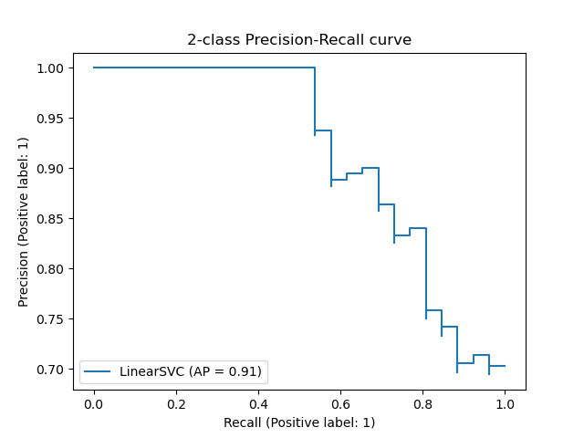
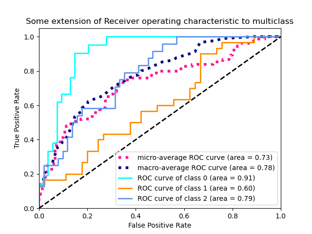

ROC Curves
==========

Classifiers like Decision Trees, Logistic Regression and Support Vector Machines do not directly predict
the target class but return a **score** value that indicates the likeliness of an observation to
belong to each class (check out the `predict_proba` method available for many classifiers in `sklearn`).

For Logistic Regression and Decision Trees, these values are real probabilities in the range `[0, 1]`.
A **decision function** maps these score values to a class: Usually we predict `1` for an observation that has a score
above the threshold of `0.5`. But the decision to use another threshold is ours!

By varying the threshold we are usually faced with a trade-off between precision and recall. 

Precision-Recall
----------------

Precision-Recall curves plot values of the True Positive Rate (Recall) against Precision values for different threshold values.

Many classifiers predict a probability or confidence score that is later turned into a class label.
For probabilistic classifiers, such as Logistic Regression, the score is a probability value between `0` and `1`.
Using scikit-learn's ``m.predict_proba()`` function, we can calculate the underlying probabilities.

|image4|

.. note::

   source: `https://scikit-learn.org/stable/auto_examples/model_selection/plot_precision_recall.html <https://scikit-learn.org/stable/auto_examples/model_selection/plot_precision_recall.html>`__

For imbalanced data problems, we are often faced with situations where recall is
more important than precision. By varying the value of the threshold we can
trade-off between these two metrics and might achieve a better result.

This idea is reflected in the **Precision-recall curve**. It calculates the precision
and recall value for different thresholds and visualizes them in a graph.
The PRC is an example a **post-training strategy**.

.. code:: python3

      from sklearn.metrics import plot_precision_recall_curve

      plot_precision_recall_curve(m, X_test, y_test)

ROC
---

A frequently used alternative are ROC-curves. ROC curves plot values of the True Positive Rate and the False Positive Rate.

|image5|

.. note::

   source: `https://scikit-learn.org/stable/auto_examples/model_selection/plot_roc.html <https://scikit-learn.org/stable/auto_examples/model_selection/plot_roc.html>`__

.. code:: python3

      from sklearn.metrics import plot_precision_recall_curve

      plot_roc_curve(m, X_test, y_test)

AUC
---

As a perfect classifier has a recall of 100% and a precision of 100% (or a False Positive Rate of 0%) we can summarize the performance
of a classifier by measuring the area under the curve:

.. hint::

   The AUC is give as the proportion of the total are in the figure above.

.. container:: banner reading

   Further Reading

.. highlights::

   - `Visualizing ROC curves and confusion matrices with Scikit <https://scikit-learn.org/stable/visualizations.html#visualizations>`__

.. container:: banner recap

   Reflection Questions

.. highlights::

   -  When is one ROC curve better than another?
   -  What is the perfect AUC?

