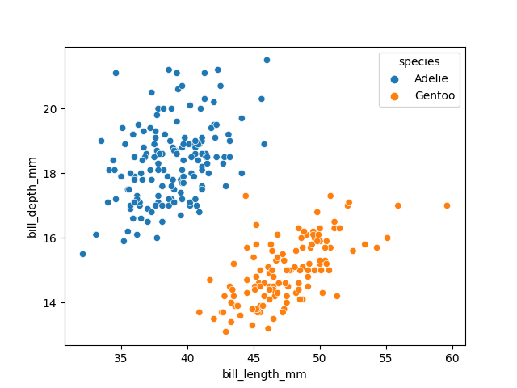
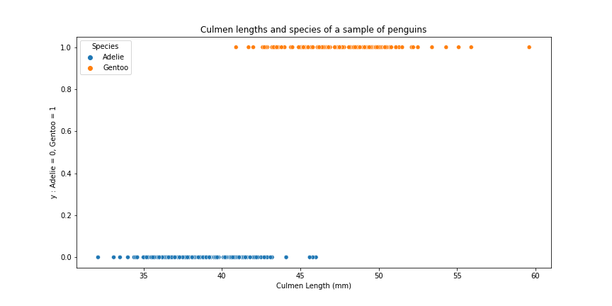
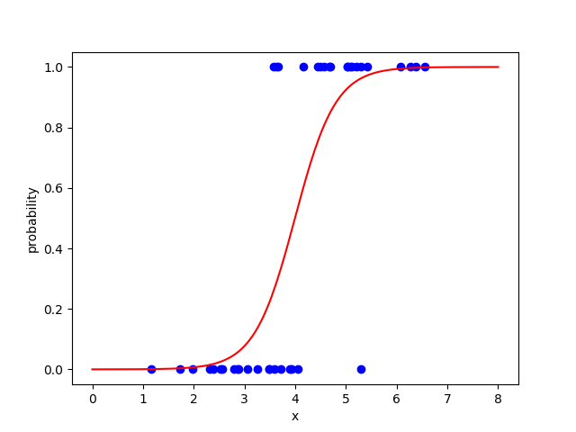

.. _logreg:

Logistic Regression
===================

Exercise: Penguins
------------------

Imagine you are a biologist wanting to assign a penguin to its correct species (**y**). 
Assume that the only information available to you is the culmen (beak) length of the penguin in mm (**x**).
You have some **labeled data** that you can use to make predictions for penguins you are going to find 
on your next expedition. Answer the following questions:

1. What type of machine learning problem are you dealing with?    
2. Looking at the figure above, what rule could you come up with to assign penguins to the correct class (species)?
3. Does the certainty of your prediction depend on the value of Culmen Length?

What is Logistic Regression?
----------------------------

Logistic regression is a classification method.
Despite its name it is not a regression method.

How does the model work?
------------------------

In a classification problem, we want to predict a category,
depending on one or more input features, e.g.:

Logistic regression uses a linear model (linear combination of
coefficients on features), but converts it to probabilities using an
exponential function called the **sigmoid function**:

or in math terms:

.. math::

   \hat{p}(y=1|X) = \frac{1}{1 + e^{-(\hat{w_0} + \hat{w_1} * x)}}

Here, :math:`w_0` is the **intercept** (also called **bias**) and :math:`\hat{w_1}` is the
**weight** (also called **coefficient**) of the single input feature.
For more than one feature, we have a weight for each feature:

.. math::

   \hat{p}(y=1|X) = \frac{1}{1 + e^{-(\hat{w_0} + \hat{w_1} * x_1 + \hat{w_2} * x_2 + \dots + \hat{w_p} * x_p)}}

Logistic regression models the **log probability** or **logit** that the
predicted variable assumes a given value.

Probability Threshold
---------------------

The output of the logistic function can be interpreted as a **probability**.
To get the actual result, we need to *threshold* it to get the predicted class.
The default threshold is 0.5:

.. math::

   \hat{y} = \begin{cases} 0 &\mbox{if } \hat{p} < 0.5 \\
   1 & \mbox{if } \hat{p} >= 0.5
   \end{cases}

Loss Function
-------------

How do we train a Logistic Regression model?

The goal of any Supervised Machine Learning model is the calculation of good 
predictions ``ypred`` based on the input training data ``Xtrain``. The process
of finding the optimal predictions is called *fitting*. 

Many models use a mathematical function that summarizes the goodness of the fit 
for all datapoints in the traning data. This function is called **Loss Function**. 

A **Loss Function** takes the true target values ``ytrain`` and the current predictions
``ypred`` and returns a *single* number. The closer that number to zero, the better 
the fit. The model tries to find the minimum possible value of the loss function.

In contrast to a linear regression, the **Logistic Regression** uses the **binary cross entropy** (also called *log loss*) as a loss function.

What does it mean? It takes the *log* of the probability of *correctly classifying* a sample as positive or negative and then average it over all samples. For a single instance:

.. math::

   loss = \begin{cases} -log(\hat{p}) &\mbox{if } y = 1 \\
   -log(1-\hat{p}) & \mbox{if } y = 0
   \end{cases}

And, for all `n` instances:

.. math::

   loss(y, \hat{p}) = {-\frac{1}{n}\sum_{i=1}^n{y_i \cdot log(\hat{p}) + (1-y_i) \cdot log(1-\hat{p})}}

Exercise: LogReg with Scikit-learn
----------------------------------

insert ``fit``, ``linear_model``, ``LogisticRegression`` and ``score`` to make the code work.

.. literalinclude:: logistic_regression.py

Example using Statsmodels
-------------------------

The `statsmodels` package gives a more detailed output:

.. code:: python3

   import statsmodels.discrete.discrete_model as sm

   logit = sm.Logit(y, X)
   f = logit.fit()
   print(f.params)
   print(f.summary())

Why don't we use linear regression instead?
-------------------------------------------

Modeling a binary variable violates some assumptions of linear regression:

-  extrapolates to values beyond 0/1 and the transition area is sloppy
-  residuals are not independent of *X*
-  residuals are not normally distributed

Pros and Cons
-------------

=========================================== ==========================================================================================
Pros                                        Cons
=========================================== ==========================================================================================
coefficients easy to interpret              requires manual feature engineering
fast                                        the decision boundary is always linear
X can be scalar, ordinal or categorical     if the data points are heavy on one side, this will strongly influence the coefficients
calculates probabilities
you can optimize the probability threshold
does not get stuck in local minima
=========================================== ==========================================================================================

Generally, be prepared for some **feature engineering** when using logistic regression.

-  one assumption is that features are linearly independent. If you know this is not the case, consider **regularizing** the model.
-  categorical features with more than two values must be **One-Hot** encoded
-  multiple one-hot-encoded features should be independent
-  missing values need to be encoded as a separate feature
-  ordinal features must be encoded as numbers
-  it is assumed that the distance between ordinals is proportional to their value (if you don't like that, use One-Hot encoding)

Predicting multiple categories
------------------------------

Normally, Logreg models only two categories.
When faced with 3+ classes, scikit-learn automatically trains multiple LogReg models
using the **One-versus-All or One-versus-Rest** strategies.
This is slower but works nicely.

Using the **Softmax** function (aka **Multinomial Logistic Regression**)
you can calculate probabilities for multiple categories as well.

In Multinomial Logistic Regression, the decision boundaries are still linear:

.. figure:: logistic_regression.png

Key Concepts
------------

================= ======================================================================
concept           description
================= ======================================================================
sigmoid function  function rapidly changing from 0 to 1
coefficients      model parameters in the linear part
probability       result of the logistic function
threshold value   probability at which a positive prediction is made (default 0.5)
log-loss          error function to be optimized
one-vs-rest       strategy for multinomial regression
softmax           activation function for multinomial regression
================= ======================================================================

.. seealso::

   `Understanding binary cross-entropy and loss <https://towardsdatascience.com/understanding-binary-cross-entropy-log-loss-a-visual-explanation-a3ac6025181a>`__ by Daniel Voigt Godoy
   
   `Logit Models for Binary Data <https://data.princeton.edu/wws509/notes/c3.pdf>`__ from Princeton

Recap Questions
---------------

- Can data used for a Logistic Regression contain string values?
- Can data used for a Logistic Regression contain missing values?
- What is a linearly separable dataset?
- Why do we minimize a loss function instead of the classification accuracy?
- What are the pros and cons of using ``scikit`` versus ``statsmodels``?
