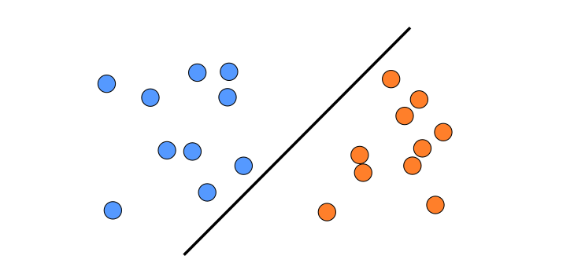
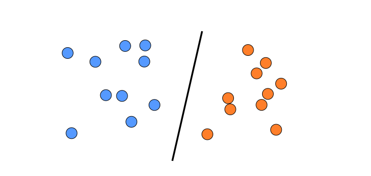
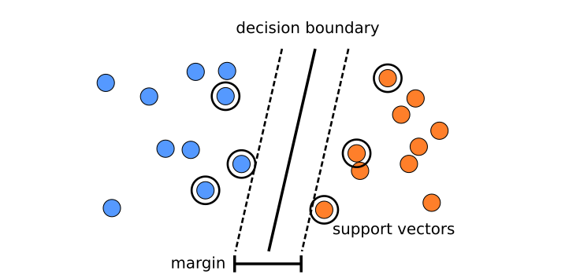
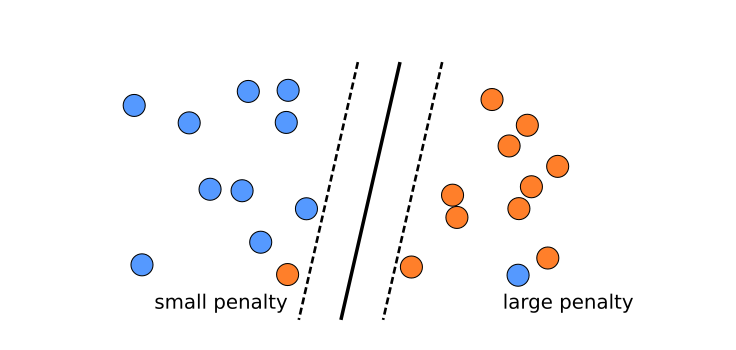
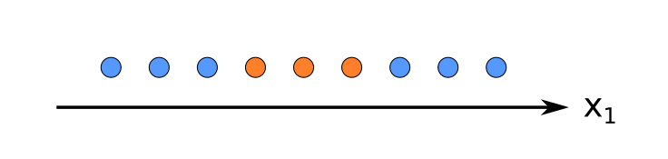
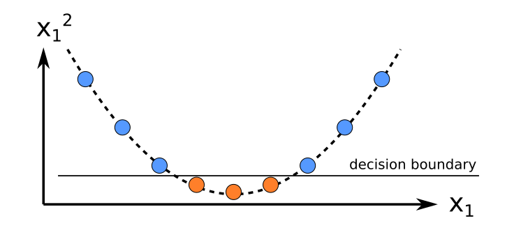
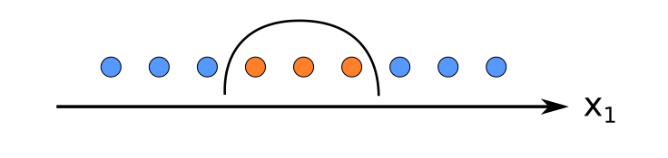

.. _svm:

Support Vector Machines
========================

**In this chapter you can learn:**

- to train SVM-based classification and regression models
- to apply different Kernels in a SVM
- to run a Grid Search to find the best hyperparameters
- to connect scaling and your model to a single pipeline

Decision Boundaries
-------------------

**Which of the two lines would you prefer to separate the two groups of points? Why?**

Key Concepts
------------

========================== =========================================================================
concept                     description
========================== =========================================================================
Support Vector             point used by a SVM to determine the decision boundary
margin                     the *"street"* on which the decision boundaries are
hard margin                no violations of the margin are allowed (less used)
soft margin                violations of the margin are allowed (depending on C)
Kernel Trick               transformation to a higher-dimensional space to find better boundaries
RBF kernel                 kernel using a Gaussian function (usually best)
polynomial kernel          kernel using a polynomial transformation (more difficult to optimize)
``gamma`` hyperparameter   determines how many data points are considered as support vectors
``C`` hyperparameter       inverse regularization strength (L1 norm)
========================== =========================================================================

A Support Vector Machine tries to find a decision boundary with the widest possible **margin**.
The margin can be defined by just a few data points, the **Support Vectors**.

Additionally, an SVM takes into account how far away misclassified points are from the decision boundary.
The closer they are, the lower penalty is assigned:

In practice, an SVM has to balance the width of the margin against minimizing the penalty.
The hyperparameter ``C`` controls that balance.

The Kernel Trick
----------------

Many datasets cannot be separated by a linear decision boundary:

But if we transform the features, e.g. by taking the square, the data becomes linearly separable:

If we transform the decision boundary back to the original space, it looks like a curve:

Support Vector Classifiers can be written as a dot product of the data ``X`` multiplied with the model parameters :math:`\alpha` .
The dot product describes a linear decision boundary (like in Logistic Regression or Linear Regression):

.. math::

   \hat y = \sum_i \alpha_iX^TX_i

The kernel trick replaces the dot product by a kernel function ``k()``:

.. math::

   \hat y = \sum_i \alpha_ik(X, X_i)

The trick is that Support Vector Machines can find the best possible transformation of the data analytically (among the potentially infine transformations).

.. figure:: SVC_Radial_Basis_Function_Kernel_web.png
   :alt:

Math terms
----------

Look up the following terms to learn more about the algebra behind SVMs:

-  quadratic problem – class of mathematical equations the SVM belongs to
-  primal problem – one variant
-  dual problem – another variant
-  QP solver – algorithm solving any of the above
-  hinge loss – loss function the QP solver optimizes
-  soft margin vs. hard margin – two approaches to define the decision boundary

Pros and Cons
-------------

Advantages of SVMs
~~~~~~~~~~~~~~~~~~

-  require less feature engineering than e.g. LogReg
-  produce nonlinear decision boundaries
-  can handle lots of features
-  soft-margin is usually better than hard margin
-  a LogReg can be run on top of an SVM to produce probabilities (done by scikit)

Disadvantages of SVMs
~~~~~~~~~~~~~~~~~~~~~

-  require scaled data
-  two hyperparameters to fine-tune
-  do not produce probabilites by themselves
-  get very slow for large data sets

Types of SVMs in Scikit-Learn
-----------------------------

Using `n` features and `m` data points.

=============== ====================================== ============== ==========================
model           performance                            kernel trick   description
=============== ====================================== ============== ==========================
LinearSVC       :math:`O(m*n)`                         no             linear decision boundary
LinearSVR       :math:`O(m*n)`                         no             regression
SVC             :math:`O(m^2*n)` to :math:`O(m^3*n)`   yes            variety of kernels
SVR             :math:`O(m^2*n)` to :math:`O(m^3*n)`   yes            regression
=============== ====================================== ============== ==========================

Exercise: Train a SVM Classifier
-------------------------------------------

Execute the code line by line:

.. literalinclude:: example.py

Train a SVM Regressor
---------------------

Train a Support Vector Regressor on the California housing dataset.

.. code:: python3

   from sklearn.datasets import fetch_california_housing
   d = fetch_california_housing()
   print(d['DESCR'])
   X, y = d['data'], d['target']

.. seealso::

   -  `SVM Tutorial <https://blog.statsbot.co/support-vector-machines-tutorial-c1618e635e93>`__
   -  `MIT notes on SVM <http://web.mit.edu/6.034/wwwbob/svm-notes-long-08.pdf>`__

Recap Questions
---------------

-  What is the fundamental idea behind Support Vector Machines?
-  What is a support vector?
-  Why is it important to scale the inputs when using SVMs?
-  Can an SVM classifier output a probability?
-  Can an SVM classifier output a confidence score when it classifies a data point?
-  Which type of SVMs should you use for a classification with 1 million data points?
-  What is a dual problem and how is it related to SVMs?

.. note::

   The recap questions were adopted from: *Hands-On Machine Learning
   with Scikit-Learn and TensorFlow by Aurélien Géron. Publisher: O'Reilly
   Media. 2017.*
