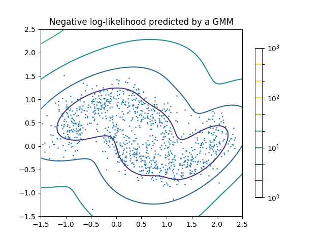

Unsupervised Learning
=====================

.. container:: banner warmup

   Unsupervised Models

.. highlights::

   Match the left and right parts of the sentences:
================================================================= ============================================
left                                                              right
================================================================= ============================================
Outlier or anomaly detection is used                              in recommenders and customer segmentation.

Principal Component Analysis (PCA) is a method                    to visualize complex datasets.

There are many clustering methods                                 to identify credit card fraud.

Non-negative Matrix Factorization (NMF) is used                   for dimensionality reduction.

Most clustering algorithms are based on a distance metric         e.g. Euclidean or Manhatten distance.

Gaussian Mixture Models (GMM) are a generative model              that do not require labled data.

Unsupervised learning is a family of ML models                    for detecting outliers.

t-SNE reduces data to two dimensions                              like K-means, DBSCAN or Ward.
================================================================= ============================================

Example: Gaussian Mixture Models
--------------------------------

Gaussian Mixture Models are used for **Anomaly Detection** or **Outlier Detection**.
They find unusual data points by defining the data by a set of Gaussian distributions.

Anomaly detection can be used e.g. for detecting credit card fraud. The problem is that the anomalies are very rare. This leads to a huge class imbalance between outliers and non-outliers. Therefore, the normal supervised learning techniques do not work.

Code Example
------------

.. literalinclude:: gmm.py

.. container:: banner reading

   Further Reading

.. highlights::

   -  `Gaussian Mixtures by Jake VdP <https://jakevdp.github.io/PythonDataScienceHandbook/05.12-gaussian-mixtures.html>`__
   -  `PyOD Outlier detection library <https://pyod.readthedocs.io/en/latest/index.html>`__
